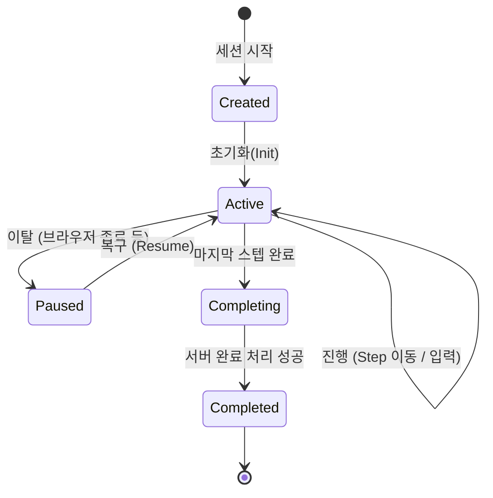

# 학습 세션 엔진 (Learning Session Engine)

## 개요

학습 세션 엔진은 사용자가 실제로 학습을 수행하는 **실행 환경(Runtime)**입니다.
단순한 정적 페이지와 달리, 사용자의 진행 상황을 추적하고, 답변을 채점하며, 중단 시에도 상태를 유지하는 **상태 머신(State Machine)**으로 동작합니다.
이 엔진은 사용자가 학습 계획(Plan)에 따라 배정된 Today Session을 클릭했을 때 구동됩니다.

---

## 의사결정 근거

- **몰입 경험**: 학습 중에는 네비게이션, 사이드바 등 방해 요소를 제거한 풀스크린 모드를 제공해야 함
- **상태 영속성**: 긴 학습 세션(20~40분) 도중 이탈해도 다시 돌아오면 정확히 그 지점부터 이어서 할 수 있어야 함
- **즉각적 피드백**: 퀴즈나 플래시카드 등은 서버 왕복 없이(Optimistic UI) 또는 최소한의 지연으로 피드백을 주어야 함

---

## 핵심 구조

세션 엔진은 크게 **Controller(로직)**, **UI State(상태)**, **Runner(데이터 동기화)**로 구성됩니다.

### 1. 세션 컨트롤러 (Session Controller)

세션의 두뇌 역할을 하며 다음과 같은 책임을 가집니다.

- **네비게이션**: 이전/다음 스텝으로 이동 가능한지 판단하고 이동 처리
- **입력 처리**: 사용자의 답안(객관식, 주관식, 매칭 등)을 상태에 반영
- **진행률 계산**: 전체 스텝 대비 현재 위치를 계산하여 프로그레스 바 갱신
- **조건부 분기**: 정답 여부나 사용자 선택에 따라 다음 스텝을 동적으로 결정 (`resolveNextStepId`)

### 2. UI 상태 (Session UI State)

세션이 활성화된 동안 메모리에 유지되는 상태입니다.

| 항목             | 설명                                                                  |
| ---------------- | --------------------------------------------------------------------- |
| **Current Step** | 현재 사용자가 보고 있는 스텝 ID                                       |
| **History**      | 사용자가 거쳐온 스텝들의 경로 (뒤로가기 지원용)                       |
| **Inputs**       | 각 스텝별 사용자 입력 값 (답안, 플래시카드 뒤집힘 여부 등)            |
| **Status**       | `ACTIVE` (진행 중), `COMPLETING` (완료 처리 중), `COMPLETED` (완료됨) |

> **State Recovery**: 세션 진입 시 서버나 로컬 스토리지에 저장된 마지막 스냅샷(`SessionRun`)을 불러와 이 상태를 복원합니다.

### 3. 데이터 동기화 (Runner & Auto-save)

- **Debounced Save**: 사용자의 입력이 발생할 때마다 매번 API를 호출하지 않고, 3초간 입력이 멈추면(Debounce) 자동으로 서버에 저장합니다.
- **Idempotency**: 네트워크 불안정으로 중복 요청이 발생해도 데이터 정합성이 깨지지 않도록 설계되었습니다.

---

## 세션 라이프사이클

1. **시작 (Start)**: `CreateOrResume` API를 호출합니다. 이미 진행 중인 기록(Run)이 있다면 불러오고, 없으면 새로 만듭니다.
2. **진행 (Active)**: 사용자가 문제를 풀고 다음으로 넘어갑니다. 백그라운드에서 진행 상황이 자동 저장됩니다.
3. **완료 (Completion)**: 마지막 스텝에 도달하면 `CompleteRun` API를 호출하여 세션을 종료하고, Plan의 진척도를 업데이트합니다.
4. **결과 (Summary)**: 완료 후에는 학습 결과 요약 페이지를 보여줍니다.

---

## 인터랙션 모델 (Interaction Model)

세션은 여러 종류의 **Step**으로 구성되며, 각 Step은 고유한 인터랙션 방식을 가집니다.

### Quiz & Check

- **객관식/주관식**: 사용자가 답을 선택/입력하면 즉시 정답 여부를 판단(로컬 채점 또는 서버 확인)합니다.
- **해설 표시**: 오답 시 또는 정답 후 해설을 제공합니다.

### Flashcard

- **Reveal**: 카드를 클릭하여 뒤집습니다.
- **Self-grade**: 알아요/몰라요를 스스로 평가합니다. 이 데이터는 추후 복습 스케줄링(SRS)에 활용됩니다.

### Matching / Speed OX

- **게임형**: 드래그 앤 드롭이나 빠른 터치로 반응하는 게임형 인터랙션입니다.

---

## 기술적 특징 (Technical Specs)

- **Optimistic Update**: 사용자 입력 시 UI는 즉시 반응하고, 저장은 비동기로 처리합니다.
- **Pre-fetching**: 다음 스텝의 이미지나 미디어 리소스를 미리 로딩하여 끊김 없는 경험을 제공합니다.
- **Responsive**: 모바일과 데스크톱 모두에서 풀스크린 경험을 최적화합니다.

---

## 에러 처리 및 복구

- **네트워크 단절**: 오프라인 상태에서도 일정 부분 진행이 가능하도록 로컬 상태를 우선시하며, 재연결 시 동기화를 시도합니다.
- **충돌 해결**: 여러 기기에서 동시에 접속할 경우, 마지막으로 저장된(Time-stamp 기준) 버전을 따릅니다.
