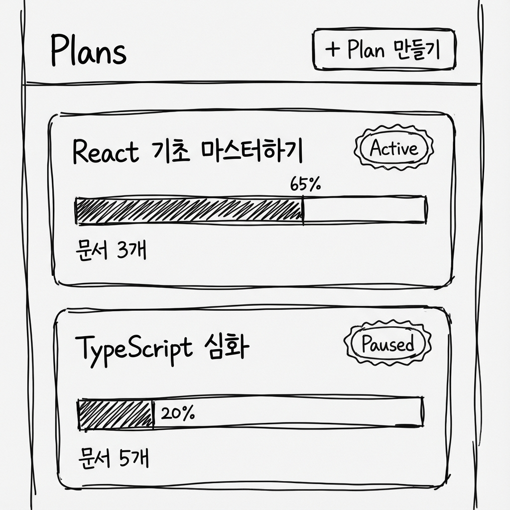

# Plans (학습 계획 관리)

## 개요

Plans 탭에서 학습 계획을 생성하고 관리합니다. Plan은 사용자가 선택한 Material들을 바탕으로 생성되는 실행 단위입니다.

---

## 의사결정 근거

- 업로드와 학습 계획 생성을 분리하여 사용자에게 통제감 부여
- Plan은 사용자가 선택한 Material들의 조합을 기반으로 생성되어 재현 가능
- Material이 추가되어도 기존 Plan은 변하지 않아 안정성 보장

---

## Plan의 정의

**Plan = 사용자가 선택한 Material들을 바탕으로 생성되는 실행 단위**

### 특징

- 생성 시점의 `sourceMaterialIds`를 고정 (재현 가능)
- 문서가 추가되어도 기존 Plan은 변하지 않음
- 새로운 문서를 반영하려면 새 Plan을 생성해야 함

---

## Plan 카드 구성

| 필드         | 설명                             |
| ------------ | -------------------------------- |
| Plan 이름    | 학습 계획 제목                   |
| 학습 목표    | 취업/이직, 자격증, 취미 등       |
| 상태         | `active` / `paused` / `archived` |
| 진행률       | 전체 진행 상태 (%)               |
| 생성일       | Plan 생성 시점                   |
| 소스 문서 수 | 연결된 문서 개수                 |

---

## 와이어프레임



---

## Plan 관리 기능

### Active Plan 전환

- 전체 학습 계획 중 **단 1개의 Active Plan**만 유지 가능
- Active Plan은 시각적으로 강조 (배지)
- 다른 Plan을 Active로 설정하면 기존 Active는 Paused로 자동 전환

### Pause / Resume

- 일시 정지 및 재개
- Paused 상태에서는 오늘 할 일에 표시 안 됨

### Archive

- 보관 처리
- 목록에는 남기고, 상태를 `archived`로 표시

---

## Plan 상태

| 상태       | 설명      | Home 큐    |
| ---------- | --------- | ---------- |
| `active`   | 활성 상태 | 표시됨     |
| `paused`   | 일시 정지 | 표시 안 됨 |
| `archived` | 보관됨    | 표시 안 됨 |

---

## UI 원칙

### 시각적 강조

- Active Plan은 시각적으로 강조 (배지, 테두리 등)
- 진행률 막대 표시

### 진입점

- Plan 클릭 시 **Plan 상세(운영 콘솔)**로 진입
- 주요 액션(시작, Pause/Resume, Archive)은 Plan 상세에서 수행

### 빈 상태

```
아직 학습 계획이 없습니다

문서를 기반으로 AI가 맞춤 학습 계획을
만들어 드립니다.

[+ Plan 만들기]
```

---

## 관련 문서

- [Plan 생성 위저드](./plan-creation-wizard.md)
- [Plan 상세](./plan-detail.md)
