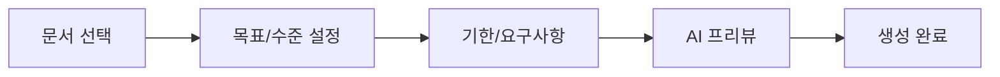

# Plan 시스템

## 개요

**Plan = 사용자가 선택한 Document들을 바탕으로 생성되는 실행 단위**

학습 계획을 생성하고 관리하는 핵심 시스템입니다.

---

## 의사결정 근거

- 업로드한 문서들을 학습 계획 생성시 재사용 가능
- Plan은 사용자가 선택한 문서들의 조합을 기반으로 생성되어 재현 가능
- 문서가 추가되어도 기존 Plan은 변하지 않아 안정성 보장

---

## Plan의 특징

### 문서 참조 고정

- 생성 시점의 `sourceDocumentIds`를 고정
- 재현 가능한 학습 계획

### 독립성

- 문서가 추가되어도 기존 Plan은 변하지 않음
- 각 Plan은 독립적으로 동작
- 새로운 문서를 반영하려면 새 Plan을 생성해야 함

---

## Plan 상태

| 상태       | 설명                    | Home 큐 표시 |
| ---------- | ----------------------- | ------------ |
| `active`   | 활성 상태, 학습 진행 중 | O            |
| `paused`   | 일시 정지               | X            |
| `archived` | 보관됨                  | X            |

### Active Plan

- Space당 1개의 Active Plan 권장
- Active Plan만 Home 큐에 표시

---

## Plan 생성 흐름

### 1. 문서 선택

- 분석 완료된 문서 중 선택
- **최소 1개, 최대 5개** 선택 가능

### 2. 학습 목표 및 수준 설정

- **학습 목표**: 취업/이직, 자격증, 업무 적용, 취미/교양
- **현재 수준**: 완전 초보 ~ 고급

### 3. 목표 기한 및 요구사항

- **목표 기한**: 원하는 기간 입력 또는 학습량에 맞춤 (AI 제안)
- **특별 요구사항**:학습 스타일이나 제약사항 등 텍스트 입력 (선택사항)

### 4. AI 프리뷰 및 생성

- 예상 커리큘럼 및 일정 확인
- 최종 Plan 생성

## Plan 구성 정보

Plan은 학습을 실행하기 위해 다음과 같은 핵심 정보를 포함합니다.

| 분류          | 항목           | 설명                                                                            |
| ------------- | -------------- | ------------------------------------------------------------------------------- |
| **기본 정보** | 제목           | 학습 계획의 이름                                                                |
|               | 상태           | 현재 진행 중(Active), 일시 정지(Paused), 보관됨(Archived) 중 하나의 상태를 가짐 |
| **학습 자료** | 참조 문서 목록 | 학습의 바탕이 되는 문서들의 고유 식별 정보 (최대 5개)                           |
| **학습 설정** | 학습 목표      | 취업, 자격증, 업무, 취미 등 사용자의 최종 목적                                  |
|               | 학습 수준      | 사용자의 현재 지식 수준 (초보 ~ 고급)                                           |
|               | 학습 기간      | 사용자가 설정한 목표 기한 또는 AI가 추천한 기간                                 |
|               | 특별 요구사항  | 학습 스타일이나 집중하고 싶은 부분 등 사용자의 추가 요청 사항                   |
| **관리 정보** | 생성 및 수정일 | 계획이 처음 만들어진 날짜와 마지막으로 변경된 날짜                              |

---

## 세션 생성

Plan 생성 시 AI가 자동으로 Session 스케줄 생성:

### Session 구성

- 예정일 (`scheduledDate`)
- 유형 (`type`): 학습 / 복습
- 예상 시간 (`duration`)
- 모듈 ID (`moduleId`)
- 세션 제목 (`title`)

### 복습 자동 포함

- Spaced Repetition 알고리즘 기반
- 자동으로 복습 세션 배치

---

## Plan 삭제 및 보관

### Plan 삭제 시 동작

Plan을 삭제하면 다음 작업이 자동으로 수행됩니다:

1. Plan 레코드 삭제
2. 연관된 Session 삭제
3. **Garbage Collection 실행**: 해당 Plan이 참조하던 소프트 삭제된 문서를 정리

### Plan 보관 시 동작

Plan 상태를 `archived`로 변경하면:

1. 상태 업데이트
2. Home 큐에서 제외
3. **Garbage Collection 실행**: 참조하던 소프트 삭제된 문서를 정리

> **참고:** Garbage Collection은 좀비 데이터(Zombie Data) 전략의 일부입니다.  
> 상세 내용은 [학습 자료 삭제 정책](../../04-engineering/policies/material-deletion.md)을 참조하세요.

---

## 관련 문서

- [Plans 페이지](../pages/plans.md)
- [Plan 생성 위저드](../pages/plan-creation-wizard.md)
- [Plan 상세](../pages/plan-detail.md)
- [학습 자료 삭제 정책](../../04-engineering/policies/material-deletion.md)
