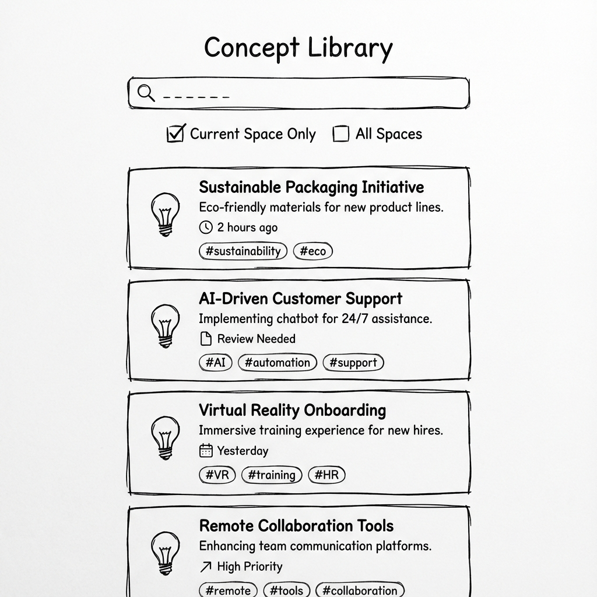

# Concept Library (지식 아카이브)

## 개요

Concept Library는 학습 과정에서 생성되는 **Concept(핵심 개념)**을 자동으로 저장하고 관리하는 지식 아카이브입니다.

---

## 의사결정 근거

- 장기 기억과 재사용은 '세션'이 아니라 '개념(Concept)' 단위로 일어남
- 사용자가 직접 정리하도록 만들면 PKM이 아니라 '노트 노동'이 됨
- 자동 저장 + 검색 중심의 단순한 구성
- **Module/Session vs Concept**: Module과 Session은 학습 경로상의 "구조/단위", Concept는 학습 완료 후 저장되는 "지식 단위"
  - 예: Module "React Hooks 마스터" / Session "useState 학습" → Concept "useState의 동작 원리", "useState 사용 예제"

---

## 기능

### 자동 저장

- 학습 과정에서 생성되는 Concept 자동 저장:
  - 정의
  - 요약
  - 예제
  - 오답
  - 주의사항

### 자동 연결

- Concept 간 관계 자동 연결:
  - 연관 토픽
  - 선행 개념

### 복습 관리

- 복습 필요도 표시 (Spaced Repetition 기반)
- 복습 시점 자동 계산

### 검색형 AI

- 질문 시 개인 아카이브를 우선 근거로 답변

---

## Concept 카드 구성

| 필드      | 설명                                      |
| --------- | ----------------------------------------- |
| 아이콘    | 학습 완료된 개념 표시 (💡) - Topic과 구분 |
| 제목      | 개념 이름                                 |
| 핵심 1줄  | 한 줄 요약                                |
| 출처      | 어느 세션에서 학습했는지 표시             |
| 최근 학습 | 마지막 학습 시점                          |
| 복습 필요 | Spaced Repetition 기반 상태               |
| 태그      | 관련 키워드                               |

---

## 와이어프레임

---

## UI 원칙

### 검색 중심

- "검색창 + 카드 리스트" 정도의 단순 구성
- 복잡한 폴더 구조 없음

### 자동 정리

- 기본은 자동 정리
- 수동 관리 요구 금지

### Space 필터

- 기본은 현재 Space 필터
- "전체 Space" 토글 옵션 제공

---

## 복습 상태

| 상태      | 색상    | 설명           |
| --------- | ------- | -------------- |
| 양호      | 🟢 초록 | 충분히 기억 중 |
| 곧 복습   | 🟡 노랑 | 복습 시점 임박 |
| 복습 필요 | 🔴 빨강 | 지금 복습 권장 |

---

## 검색 기능

### 검색 대상

- Concept 제목
- 요약 내용
- 태그

### 필터 옵션

- Space 필터 (현재/전체)
- 복습 상태 필터
- 최근 학습 정렬

---

## 관련 문서

- [Concept 상세](./concept-detail.md)
