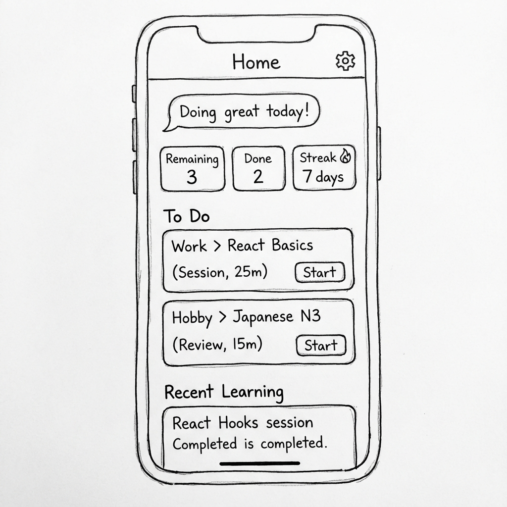

# 홈 (/home)

## 개요

홈은 '무엇을 할지'를 결정하는 곳이 아니라, **AI가 준비한 오늘의 학습을 한눈에 확인하고 시작하는 출발점**입니다.

---

## 의사결정 근거

- 홈은 대시보드이자 출발점이어야 하며, 학습 화면과 섞이면 복잡도가 급증
- 사용자가 "무엇을 해야 하지?"를 고민하지 않게 하는 것이 홈의 목적
- **활성화된 모든 학습 계획(Active Plans)에서 해야 할 항목을 전역으로 집계**하여 표시

---

## 구성 요소

### 1. 할 일 큐 (전역)

**집계 대상**: 모든 활성 계획(Active Plan)에서 현재(today)에 해당하는 Session

**노출 단위**: "해야 할 목록(큐)"

**노출 방식**:

- 홈에서는 상위 1~3개만 간단히 노출
- 큐가 더 많을 경우 “전체 보기”로 `/today`에서 전체 목록 확인

**항목 구성**:
| 필드 | 설명 |
|------|------|
| Plan명 | 해당 세션이 속한 학습 계획 |
| 모듈명 + 세션명 | 예: "Module 2: Hooks / Session 1: useState" |
| 예상 소요시간 | 세션 예상 시간 (예: 25분) |
| 유형 | 세션 |
| 상태 | 대기 / 진행 중 / 완료 |

**액션**: "시작"을 누르면 즉시 **풀스크린 Session View**로 진입

### 2. 대시보드 요약

- 남은 할 일 수
- 완료한 항목 수
- 예상 학습 시간
- **연속 학습일 (Streak)** - 🔥 아이콘과 함께 강조 표시
  - 동기부여를 위한 게이미피케이션 요소
  - 예: "🔥 7일 연속 학습 중!"

### 3. AI 코칭 메시지

- 학습 상황에 따른 격려 및 피드백 메시지
- 예: "오늘도 잘하고 있어요! 💪"
- 목표 달성 시: "목표 달성을 축하합니다! 🎉"

### 3. 최근 세션 요약 카드

- 예: "방금 학습한 3개의 개념이 아카이브에 저장되었습니다"
- CTA: "학습 계획 상세에서 보기"
- 최근 완료한 세션 카드 목록 (2~3개)

---

## 와이어프레임

---

## UI 원칙

### 선택 최소화

- 할 일 큐에서 바로 시작
- 복잡한 필터/정렬 없음

### 과도한 노출 방지

- 학습 상세 콘텐츠를 홈에 과도하게 노출하지 않음
- 상세는 해당 페이지에서 확인

### 이동 불필요

- 여러 메뉴를 이동하며 할 일을 찾는 행위가 필요 없음
- 홈에서 모든 학습 계획의 할 일을 한눈에

---

## 상태별 UI

### 할 일이 있을 때

- 할 일 큐 표시
- 첫 번째 항목 강조

### 모든 할 일 완료

- 🎉 축하 메시지와 성취 애니메이션
- "학습을 모두 완료했어요! 🎊"
- 연속 학습일수가 증가한 경우 강조 표시
- 다음 예정 간략 표시 (선택)
- 게이미피케이션: 완료 배지 또는 업적 표시 (향후 확장)

### 할 일이 없을 때 (Plan 없음)

- "학습을 시작해볼까요?" 격려 메시지
- CTA: "학습 자료 업로드" 또는 "Plan 만들기"
- 온보딩: 처음 방문 사용자에게 간단한 가이드 제공
