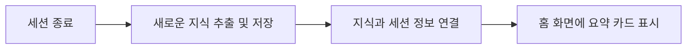

# 세션 요약 (Session Summary)

## 개요

세션 상세 페이지를 별도로 만들지 않고, **세션 요약 카드**로 '방금 배운 것 다시 보기' 니즈를 최소 UI로 충족합니다.

---

## 의사결정 근거

- 세션 상세 페이지가 누적되면 결국 LMS형 "레슨 목록"이 됨
- 사용자는 '방금 배운 것'만 빠르게 다시 확인하길 원함
- 중복을 막기 위해 지식은 Concept에 저장하고, 세션은 묶음/로그로만 남김

---

## 세션 요약 카드 요소

| 필드                       | 설명                     |
| -------------------------- | ------------------------ |
| 학습 날짜                  | 세션 진행 날짜           |
| 모듈명                     | 세션이 속한 모듈         |
| 세션명                     | 세션 제목                |
| 생성/업데이트된 Concept 수 | 예: "개념 3개 저장"      |
| 생성된 복습 카드 수        | 예: "복습 2개 예정"      |
| CTA                        | "아카이브에서 보기" 버튼 |

---

## 와이어프레임

## 접근 경로

1. **홈 (Home)**: '최근 학습' 타임라인에서 카드 클릭
2. **Plan 상세**: 커리큘럼 리스트에서 '완료된 세션' 클릭

---

## 와이어프레임

### 홈에서의 표시

```
┌──────────────────────────────────┐
│ 최근 학습                         │
├──────────────────────────────────┤
│ ┌────────────────────────────┐  │
│ │ ✅ Day 3: React Hooks      │  │
│ │    2025.01.17 • 25분       │  │
│ │    개념 3개 저장 • 복습 2개 │  │
│ │              [보기 →]      │  │
│ └────────────────────────────┘  │
│                                  │
│ ┌────────────────────────────┐  │
│ │ ✅ Day 2: JSX 문법         │  │
│ │    2025.01.16 • 20분       │  │
│ │    개념 2개 저장 • 복습 1개 │  │
│ │              [보기 →]      │  │
│ └────────────────────────────┘  │
└──────────────────────────────────┘
```

---

## 세션과 지식 개념의 저장 관계

### 지식의 연결 방식

- **하나의 세션에서 여러 개념을 배움**: 한 번의 학습 세션(예: 25분)을 통해 3~5개의 새로운 핵심 개념들을 습득하고 저장할 수 있습니다.
- **하나의 개념이 여러 세션에 등장**: 중요한 개념은 한 번에 끝나지 않고, 이후 여러 번의 복습 세션이나 심화 세션에서 다시 다뤄질 수 있습니다.

### 역할 분리

- **지식 개념 (Concept)**: 실제 공부한 내용이 담긴 '지식 도서관'의 책과 같습니다.
- **학습 세션 (Session)**: 특정 날짜에 수행한 '학습 활동의 기록'입니다.

---

## 지식 저장 과정



1. 세션이 종료되면 AI가 학습 내용 중 중요한 지식들을 골라내어 저장하거나 기존 지식을 보완합니다.
2. 각 지식 데이터에는 어떤 세션을 통해 학습되었는지에 대한 연결 정보가 함께 기록됩니다.
3. 홈 화면에서는 방금 끝난 학습의 요약 카드를 즉시 확인할 수 있습니다.

---

## "아카이브에서 보기" 동작

### 클릭 시

1. Concept Library로 이동
2. 해당 세션에서 생성/업데이트된 Concept만 필터링하여 표시
3. 필터 칩: "Day 3 세션" 표시

### 필터 해제 시

- 전체 Concept 목록으로 복귀

---

## UI 원칙

### 가벼운 요약

- 필수 정보만 표시
- 상세는 Concept Library에서

### 빠른 접근

- "보기" 클릭으로 바로 해당 Concept들 확인
- 불필요한 중간 단계 없음

### 시간순 정렬

- 최신 세션이 상단에
- 오래된 세션은 스크롤로 확인
