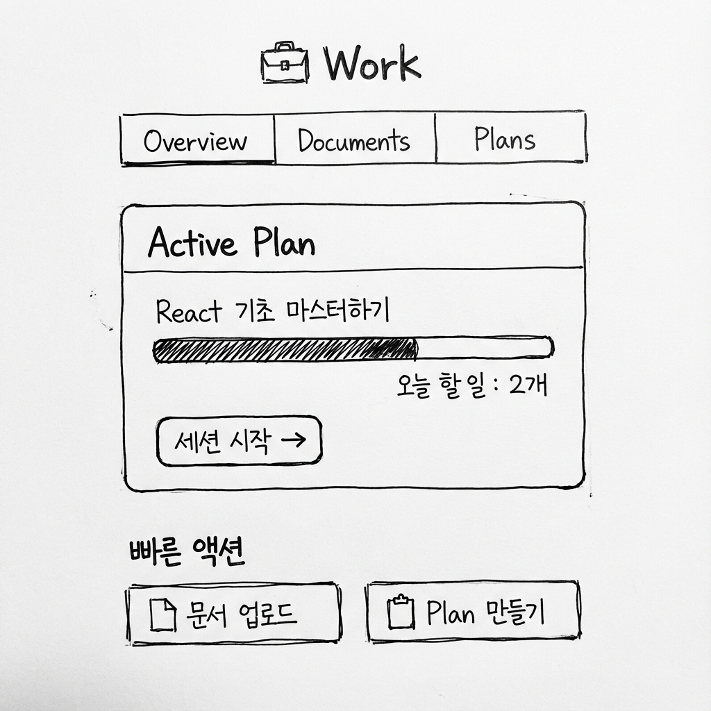

# Space 상세 (/spaces/:id)

## 개요

Space 상세 페이지는 **단일 학습 의도/목표의 컨테이너**로서, 문서 관리, Plan 생성/관리, 학습 현황 파악이 이루어지는 곳입니다.

---

## 의사결정 근거

- Space는 단일 학습 의도/목표의 컨테이너
- Space 내부에서 문서 관리, Plan 생성/관리, 학습 현황 파악이 이루어짐
- 탭 구조로 관련 기능을 그룹화

---

## 구성 요소 (탭 구조)

### 탭 네비게이션

```
[Overview] [Documents] [Plans] [Concepts]
```

---

## 1. Overview 탭

**목적**: 요약 및 빠른 액션

### 구성 요소

- Active Plan 요약
  - Plan 이름
  - 진행률 (%)
  - 오늘 할 일 수
- 빠른 CTA
  - "Plan 만들기" (Plan 없을 때)
  - "문서 업로드"
  - "세션 시작" (Active Plan 있을 때)
- 최근 활동 요약

### 와이어프레임



---

## 2. Documents 탭

**목적**: 업로드된 자료 목록 및 관리

> 상세 기획은 [Documents 페이지](./documents.md) 참조

### 주요 기능

- 자료 목록 (카드/리스트)
- 자료 업로드
- 태그/요약 확인
- 분석 상태 확인

---

## 3. Plans 탭

**목적**: 학습 계획 생성 및 관리

> 상세 기획은 [Plans 페이지](./plans.md) 참조

### 주요 기능

- Plan 목록 (하루/1주/1달 등)
- Active Plan 전환

- Plan 클릭 시 → Plan 상세(운영 콘솔)로 진입

---

## 4. Concepts 탭

**목적**: 해당 Space의 지식 아카이브

> 상세 기획은 [Concept Library 페이지](./concept-library.md) 참조

### 주요 기능

- 해당 Space 기준 필터 (기본)
- 전역 검색 토글 옵션
- Concept 카드 목록
- 검색

---

## UI 원칙

### 헤더

- 상단에 Space 이름 표시
- Space 전환 드롭다운 (선택)

### 네비게이션

- 탭 또는 사이드 내비게이션으로 하위 섹션 전환
- **Overview가 기본 진입 화면**

### 일관성

- 모든 탭에서 동일한 레이아웃 패턴
- 명확한 현재 탭 표시

---

## 라우팅

| 경로                        | 설명                          |
| --------------------------- | ----------------------------- |
| `/spaces/:id`               | Space 상세 (Overview 탭 기본) |
| `/spaces/:id?tab=documents` | Documents 탭                  |
| `/spaces/:id?tab=plans`     | Plans 탭                      |
| `/spaces/:id?tab=concepts`  | Concepts 탭                   |
