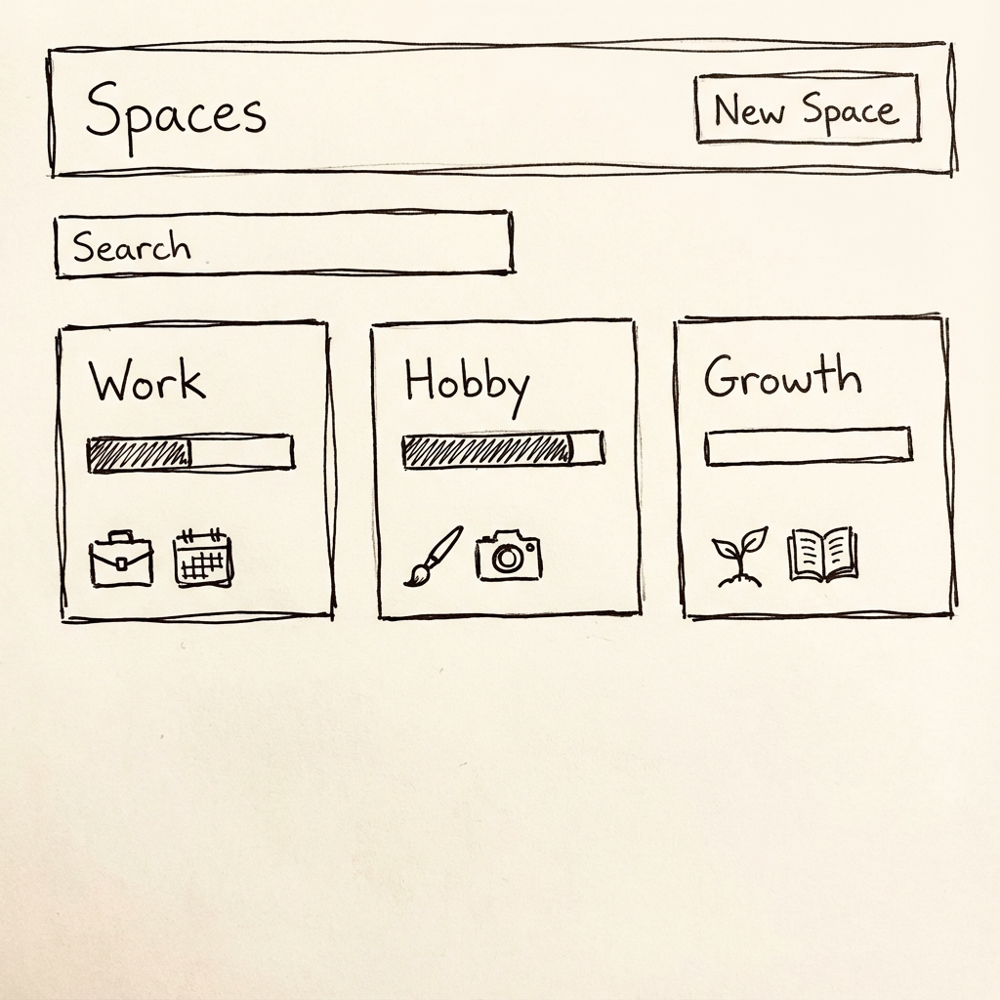

# Spaces 목록 (/spaces)

## 개요

Spaces 페이지는 여러 **Space를 만들고 전환하는 허브**입니다.

---

## 의사결정 근거

- 사용자는 여러 학습 의도/목표를 동시에 가질 수 있음
- Space로 분리하면 각 학습 영역이 서로 간섭하지 않음
- Projects/Spaces 패턴을 따라 직관적인 허브 제공

---

## 기능

### 주요 기능

- 여러 Space 목록 표시
- 새 Space 생성
- Space 현황 요약 확인
- 빠른 검색/필터

---

## Space 카드 구성

각 Space는 카드 형태로 표시됩니다.

| 필드                   | 설명                       |
| ---------------------- | -------------------------- |
| Space 이름             | 학습 영역 이름             |
| 대표 태그/아이콘       | 시각적 구분                |
| Active Plan 진행률 (%) | 현재 활성 Plan의 진행 상태 |
| 오늘 할 일 존재 여부   | 뱃지 또는 점으로 표시      |

---

## 와이어프레임



---

## UI 원칙

### 레이아웃

- 카드 그리드 또는 리스트
- 반응형: 모바일에서는 1컬럼

### Space 생성

- 간단한 마법사로 진행
- 최소 입력: 이름, 아이콘/색상

### 검색/필터

- 빠른 검색 제공
- 기본은 최근 사용 순 정렬

---

## 빈 상태

### Space가 없을 때

```
첫 번째 학습 공간을 만들어보세요!

Space는 하나의 학습 목표를 담는 공간입니다.
예: "프론트엔드 마스터하기", "일본어 N3 합격"

[+ Space 만들기]
```

---

## Space 생성 마법사

### Step 1: 기본 정보

- Space 이름 (필수)
- 설명 (선택)
- 아이콘/색상 선택

### Step 2: 완료

- "Space가 생성되었습니다!"
- CTA: "자료 업로드하기" 또는 "나중에"

---

## 기본 템플릿

최초 가입 시 기본 Space 템플릿 3개 제공:

| 템플릿     | 설명               |
| ---------- | ------------------ |
| **Work**   | 업무 관련 학습     |
| **Hobby**  | 취미 관련 학습     |
| **Growth** | 자기계발 관련 학습 |
