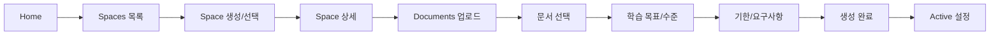

# 사용자 플로우

## 개요

이 문서는 사용자가 플랫폼을 사용하는 핵심 플로우를 정의합니다. 습관화를 위해 '매일 동일한 시작 동작'을 제공하고, 플로우가 길어질수록 이탈이 증가하므로 핵심 루프만 남깁니다.

---

## 핵심 사용자 행동

사용자는 오직 **4가지**만 하면 됩니다:

1. **목표 말하기** (Space 생성)
2. **자료 업로드**
3. **문서 선택 후 Plan 생성**
4. **세션 시작하기**

---

## 평소 학습 루프 (Daily Loop)

매일 반복되는 핵심 학습 루프입니다.

```mermaid
flowchart LR
    A[Home 접속] --> B[오늘 할 일 확인]
    B --> B2[전체 보기 (/today)]
    B --> C[시작 클릭]
    C --> D[풀스크린 세션]
    D --> E[세션 종료]
    E --> F[세션 요약 카드 생성]
    F --> A
```

### 단계별 설명

| 단계           | 설명                                    |
| -------------- | --------------------------------------- |
| Home 접속      | Home 페이지에서 모든 Space의 할 일 확인 |
| 할 일 확인     | 전역 큐에서 세션/복습 항목 확인         |
| 전체 보기      | 오늘 할 일 페이지에서 오늘 큐 전체 확인 |
| 시작 클릭      | "시작" 버튼만 누르면 됨                 |
| 풀스크린 세션  | 몰입형 학습 진행 (20~40분)              |
| 세션 종료      | 학습 완료                               |
| 세션 요약 생성 | 홈에 요약 카드로 표시                   |

---

## 학습 생성 루프 (Plan Creation Loop)

새로운 학습을 시작할 때의 플로우입니다.



### 단계별 설명

| 단계             | 페이지                  | 설명                                    |
| ---------------- | ----------------------- | --------------------------------------- |
| Space 선택       | `/spaces`               | 기존 Space 선택 또는 새로 생성          |
| Documents 업로드 | `/spaces/:id/documents` | 학습 자료 업로드                        |
| 문서 선택        | Plan 위저드 Step 1      | Plan에 포함할 문서 선택 (최대 5개)      |
| 학습 목표/수준   | Plan 위저드 Step 2      | 학습 목표와 현재 수준 설정              |
| 기한/요구사항    | Plan 위저드 Step 3      | 목표 기한 및 특별 요구사항 입력 후 생성 |
| 생성 완료        | Plan 위저드 완료        | Plan 확정 및 Active 설정                |

---

## 온보딩 플로우

신규 사용자의 첫 경험입니다.


### 기본 Space 템플릿

- **Work**: 업무 관련 학습
- **Hobby**: 취미 관련 학습
- **Growth**: 자기계발 관련 학습

---

## 보조 플로우

### 오늘 할 일 확인 플로우

```
Home → (전체 보기) Today → 세션 시작
```

### 진행 상황 확인 플로우

```
Home → Spaces → Space 상세 → Plan 상세 → Curriculum
```

### 설정 변경 플로우

```
어느 화면에서든 → 사용자 메뉴 → Settings Dialog
```

---

## 플로우 설계 원칙

### 1. 최소 클릭

- 가장 빈번한 행동(세션 시작)은 1클릭으로 가능
- 불필요한 확인/설정 단계 제거

### 2. 명확한 경로

- 사용자가 현재 위치를 항상 알 수 있음
- 다음 행동이 명확함

### 3. 자연스러운 복귀

- 세션 완료 후 자연스럽게 홈으로 복귀
- 중단 시 이어서 진행 가능
