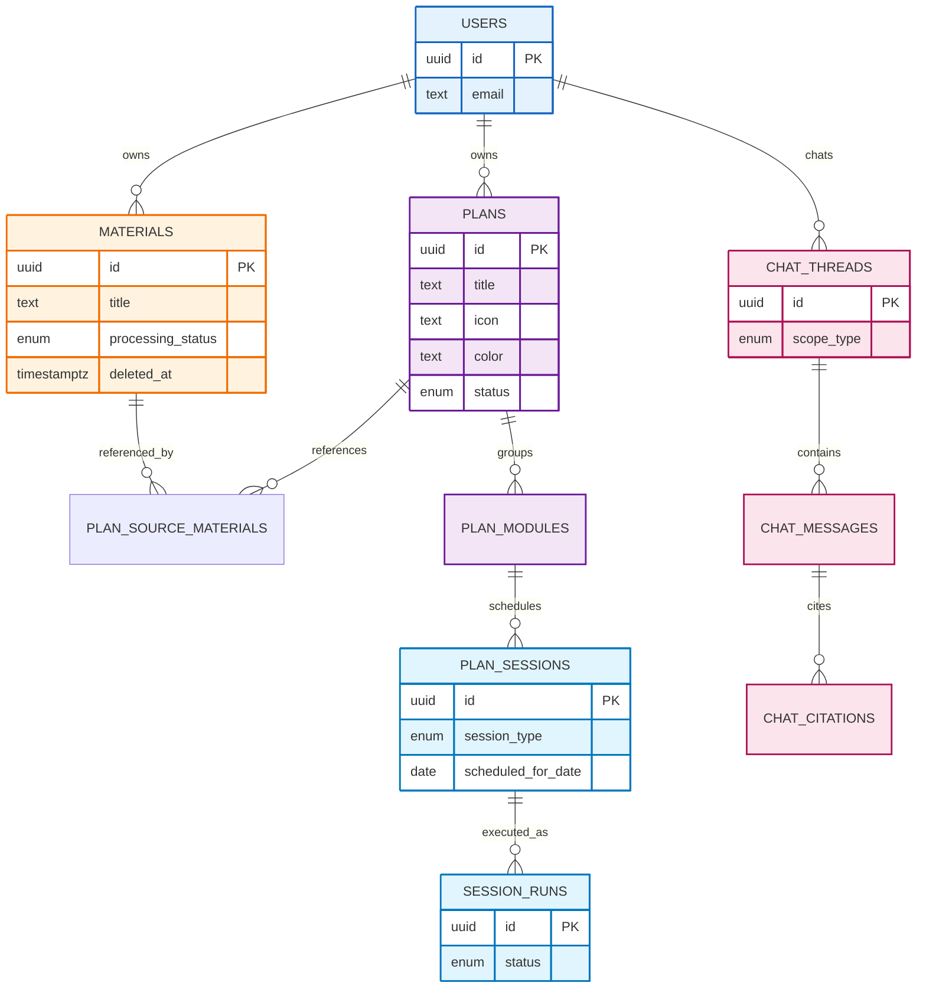

# 데이터 모델 (Data Models)

## 개요

이 문서는 AI 개인화 학습 플랫폼(Learning OS)의 **전체 기능을 빠짐없이 구현**할 수 있도록,
도메인 엔티티와 관계, 스키마 설계 원칙을 정의합니다.

- **Material**: 업로드/입력된 학습 자료 (User 전역 공유)
- **Plan**: 학습 자료 기반의 학습 실행 단위 (Icon, Color 등 UI 속성 포함)
- **Module / Session**: 커리큘럼과 일일 실행 단위(학습)
- **AI Chat**: Plan/Session 범위의 대화 및 근거(청크) 인용
- **Zombie Data(좀비 데이터)**: `deleted_at` 기반 소프트 삭제 + GC(가비지 컬렉션)

> 기술 스택 가정: PostgreSQL + Drizzle ORM + pgvector + R2(Object Storage)

## 설계 원칙

### 1) 스코프 규칙 (User → 리소스)

- 모든 핵심 데이터는 `user_id`를 통해 소유권을 명확히 합니다.
- 기존의 Space(학습 공간) 개념은 제거되었으며, 모든 Materials와 Plans는 사용자의 계정 내에서 전역적으로 관리됩니다.

### 2) “Materials”는 UI/DB 공통 용어

- 제품 전반에서 **Materials**라는 용어를 일관되게 사용합니다.

### 3) 소프트 삭제 기본값

- `materials.deleted_at IS NULL`이면 정상 노출
- `deleted_at`이 설정되면 UI에서 숨기되, Plan이 참조 중이면 시스템에는 유지
- GC 트리거(Plan 완료/삭제 등) 시 “참조가 0”인 소프트 삭제 Material을 물리 제거

### 4) 실행(Session)과 기록(Session Run)을 분리

- **Plan Session(스케줄)**: “오늘 할 일(큐)”에 올라오는 실행 단위
- **Session Run(실행 기록)**: 사용자가 실제로 수행한 시도(시작/종료/중간이탈/복구)

---

## 엔티티 관계도 (Core ERD)

---

## 엔티티/테이블 정의

아래 표기는 “권장” 스키마입니다. 실제 Drizzle 구현 시 네이밍은 `snake_case`를 권장합니다.

---

# 1. Identity & Access (로그인/세션)

## USERS

| 필드          | 타입          | 설명                |
| ------------- | ------------- | ------------------- |
| id            | uuid (PK)     | 사용자 ID           |
| email         | text (unique) | 로그인 이메일       |
| display_name  | text          | 표시 이름           |
| avatar_url    | text          | 프로필 이미지       |
| status        | enum          | `ACTIVE / DISABLED` |
| locale        | text          | 예: `ko-KR`         |
| timezone      | text          | 예: `Asia/Seoul`    |
| created_at    | timestamptz   | 생성 시각           |
| updated_at    | timestamptz   | 수정 시각           |
| last_login_at | timestamptz   | 마지막 로그인       |

---

# 2. Materials (Documents) + 처리 파이프라인

## MATERIALS (Documents)

| 필드              | 타입        | 설명                                    |
| ----------------- | ----------- | --------------------------------------- |
| id                | uuid (PK)   | Material ID                             |
| user_id           | uuid (FK)   | 소유자                                  |
| sourceType        | enum        | `FILE / URL / TEXT`                     |
| title             | text        | 문서 제목                               |
| original_filename | text        | 파일 업로드 시                          |
| source_url        | text        | URL 입력 시                             |
| raw_text          | text        | TEXT 입력 시(또는 추출 텍스트 요약본)   |
| storage_provider  | enum        | `R2`                                    |
| storage_key       | text        | R2 object key                           |
| mime_type         | text        | 예: `application/pdf`                   |
| file_size         | bigint      | 바이트                                  |
| checksum          | text        | 중복/무결성(선택)                       |
| processing_status | enum        | `PENDING / PROCESSING / READY / FAILED` |
| processed_at      | timestamptz | 분석 완료 시각                          |
| summary           | text        | AI 1줄/짧은 요약                        |
| error_message     | text        | 실패 시                                 |
| deleted_at        | timestamptz | **소프트 삭제(좀비 데이터 핵심)**       |
| created_at        | timestamptz | 생성                                    |
| updated_at        | timestamptz | 수정                                    |

### 권장 인덱스

- `(user_id, created_at desc)`
- `(user_id) WHERE deleted_at IS NULL` (부분 인덱스)
- `(processing_status, user_id)` (READY 문서만 Plan에 선택 가능)

---

# 3. Plans (생성/운영) + 스냅샷 참조

## PLAN_GENERATION_REQUESTS

| 필드                 | 타입        | 설명                                                             |
| -------------------- | ----------- | ---------------------------------------------------------------- |
| id                   | uuid (PK)   | 요청 ID                                                          |
| user_id              | uuid (FK)   | 사용자                                                           |
| status               | enum        | `DRAFT / SUBMITTED / GENERATING / SUCCEEDED / FAILED / CANCELED` |
| goal_type            | enum        | `JOB / CERT / WORK / HOBBY / OTHER`                              |
| goal_text            | text        | 자유 입력(선택)                                                  |
| current_level        | enum        | `BEGINNER / INTERMEDIATE / ADVANCED`                             |
| target_due_date      | date        | 목표 기한                                                        |
| special_requirements | text        | 요구사항                                                         |
| preview_json         | jsonb       | AI 프리뷰(선택)                                                  |
| error_message        | text        | 실패                                                             |
| created_at           | timestamptz | 생성                                                             |
| updated_at           | timestamptz | 수정                                                             |

## PLANS

| 필드                  | 타입        | 설명                                     |
| --------------------- | ----------- | ---------------------------------------- |
| id                    | uuid (PK)   | Plan ID                                  |
| user_id               | uuid (FK)   | 사용자                                   |
| generation_request_id | uuid (FK)   | 생성 요청(선택)                          |
| title                 | text        | Plan명                                   |
| icon                  | text        | 아이콘 키 (예: `target`, `book`)         |
| color                 | text        | 색상 키 (예: `blue`, `green`)            |
| status                | enum        | `ACTIVE / PAUSED / ARCHIVED / COMPLETED` |
| goal_type             | enum        | 위와 동일                                |
| goal_text             | text        | 선택                                     |
| current_level         | enum        | 위와 동일                                |
| target_due_date       | date        | 목표 기한                                |
| special_requirements  | text        | 요구사항                                 |
| started_at            | timestamptz | Active 전환 시점(선택)                   |
| completed_at          | timestamptz | 완료                                     |
| archived_at           | timestamptz | 보관                                     |
| deleted_at            | timestamptz | 삭제(선택)                               |
| created_at            | timestamptz | 생성                                     |
| updated_at            | timestamptz | 수정                                     |

### 권장 제약/인덱스

- 사용자당 **ACTIVE Plan 1개** 강제: `UNIQUE(user_id) WHERE status='ACTIVE'`

## PLAN_SOURCE_MATERIALS

Plan이 생성될 때 참조한 Material의 스냅샷 관계를 관리합니다.

| 필드        | 타입        | 설명               |
| ----------- | ----------- | ------------------ |
| id          | uuid (PK)   | 관계 ID            |
| plan_id     | uuid (FK)   | 대상 Plan          |
| material_id | uuid (FK)   | 참조 Material      |
| created_at  | timestamptz | 생성 (스냅샷 시점) |

## PLAN_MODULES

Plan 내부의 학습 대단위(모듈)를 정의합니다.

| 필드        | 타입        | 설명      |
| ----------- | ----------- | --------- |
| id          | uuid (PK)   | 모듈 ID   |
| plan_id     | uuid (FK)   | 대상 Plan |
| title       | text        | 모듈 제목 |
| description | text        | 모듈 설명 |
| order_index | integer     | 순서      |
| created_at  | timestamptz | 생성      |

---

# 4. Curriculum: Modules & Sessions

## PLAN_SESSIONS

| 필드               | 타입        | 설명                                                       |
| ------------------ | ----------- | ---------------------------------------------------------- |
| id                 | uuid (PK)   | Session ID                                                 |
| plan_id            | uuid (FK)   | Plan                                                       |
| session_type       | enum        | `LEARN`                                                    |
| title              | text        | 예: `Session 1: useState`                                  |
| scheduled_for_date | date        | “오늘 할 일” 기준일                                        |
| status             | enum        | `SCHEDULED / IN_PROGRESS / COMPLETED / SKIPPED / CANCELED` |
| created_at         | timestamptz | 생성                                                       |

---

# 5. Session Execution

## SESSION_RUNS

| 필드       | 타입        | 설명                              |
| ---------- | ----------- | --------------------------------- |
| id         | uuid (PK)   | 실행 ID                           |
| session_id | uuid (FK)   | 스케줄 세션                       |
| user_id    | uuid (FK)   | 사용자                            |
| plan_id    | uuid (FK)   | Plan                              |
| status     | enum        | `RUNNING / COMPLETED / ABANDONED` |
| started_at | timestamptz | 시작                              |
| ended_at   | timestamptz | 종료                              |
| created_at | timestamptz | 생성                              |

---

# 6. AI Chat

## CHAT_THREADS

| 필드       | 타입        | 설명             |
| ---------- | ----------- | ---------------- |
| id         | uuid (PK)   | 스레드 ID        |
| user_id    | uuid (FK)   | 사용자           |
| scope_type | enum        | `PLAN / SESSION` |
| scope_id   | uuid        | 해당 리소스 ID   |
| created_at | timestamptz | 생성             |
| updated_at | timestamptz | 수정             |

## CHAT_MESSAGES

| 필드       | 타입        | 설명                        |
| ---------- | ----------- | --------------------------- |
| id         | uuid (PK)   | 메시지 ID                   |
| thread_id  | uuid (FK)   | 소속 스레드                 |
| role       | enum        | `USER / ASSISTANT / SYSTEM` |
| content    | text        | 메시지 본문                 |
| created_at | timestamptz | 생성                        |

## CHAT_CITATIONS

메시지 답변의 근거가 된 문서 청크 인용 정보를 저장합니다.

| 필드        | 타입        | 설명                      |
| ----------- | ----------- | ------------------------- |
| id          | uuid (PK)   | 인용 ID                   |
| message_id  | uuid (FK)   | 해당 답변 메시지          |
| material_id | uuid (FK)   | 근거 문서                 |
| chunk_index | integer     | 청크 번호                 |
| snippet     | text        | 인용된 텍스트 조각 (선택) |
| created_at  | timestamptz | 생성                      |

---

## 관련 문서

- [기술 스택](./tech-stack.md)
- [시스템 아키텍처](./architecture.md)
- [학습 자료 삭제 정책(좀비 데이터)](./policies/material-deletion.md)
