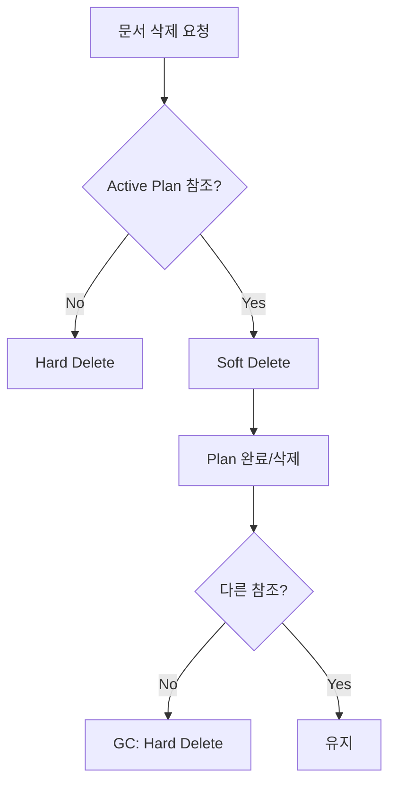

# ADR 0002: Plan 문서 참조 계약

## 상태

**확정** (2025-12)

---

## 컨텍스트

Plan은 사용자가 선택한 문서들을 기반으로 학습 커리큘럼을 생성합니다. 다음 문제에 대한 결정이 필요합니다:

1. Plan이 문서를 어떻게 참조할 것인가?
2. 문서가 변경되면 Plan은 어떻게 동작할 것인가?
3. 문서가 삭제되면 Plan은 어떻게 동작할 것인가?

---

## 결정

**ID 고정 참조 + 불변성 정책**을 채택합니다.

### 핵심 계약

1. Plan 생성 시 선택된 문서 ID를 `plan_source_materials` 테이블에 저장
2. Plan은 생성 시점의 문서 상태를 기준으로 동작
3. 이후 문서 추가/수정/삭제가 기존 Plan에 영향을 주지 않음

---

## 상세 설계

### 데이터 모델

```sql
-- Plan이 참조하는 문서 목록
CREATE TABLE plan_source_materials (
  plan_id           UUID REFERENCES plans(id),
  material_id       UUID REFERENCES materials(id),
  material_title_snapshot TEXT,    -- 생성 당시 제목 (표시용)
  order_index       INT,
  created_at        TIMESTAMPTZ DEFAULT NOW(),
  PRIMARY KEY (plan_id, material_id)
);
```

### 불변성 규칙

| 시나리오       | Plan 동작                              |
| -------------- | -------------------------------------- |
| 문서 내용 변경 | 기존 Plan은 변경 전 청크/임베딩 사용   |
| 새 문서 추가   | 기존 Plan에 영향 없음, 새 Plan 필요    |
| 문서 삭제      | 소프트 삭제, Plan 완료까지 시스템 유지 |

### 삭제/GC 연계



---

## 근거

### 채택 이유

1. **학습 재현성**
   - 동일한 Plan은 항상 동일한 학습 경험 제공
   - 커리큘럼이 중간에 변하면 학습자 혼란

2. **데이터 무결성**
   - RAG 검색 시 Plan 기준 문서만 검색
   - 문서 삭제로 인한 검색 실패 방지

3. **단순한 UX**
   - 사용자가 삭제/수정의 영향을 고민할 필요 없음
   - "새 문서를 반영하려면 새 Plan 생성" 규칙 명확

### 대안 검토

| 옵션        | 설명                       | 결과                    |
| ----------- | -------------------------- | ----------------------- |
| 동적 참조   | Plan이 항상 최신 문서 사용 | 기각 - 학습 경험 불안정 |
| 전체 복사   | 문서 내용을 Plan에 복사    | 기각 - 저장 공간 낭비   |
| **ID 고정** | ID만 저장, 필요시 조회     | **채택**                |

---

## 구현 지침

### Plan 생성 시

```typescript
async function createPlan(input: CreatePlanInput) {
  // 1. 문서 상태 검증
  const materials = await db.select()
    .from(materials)
    .where(inArray(materials.id, input.materialIds))
    .where(eq(materials.processingStatus, 'READY'));

  if (materials.length !== input.materialIds.length) {
    throw new Error('일부 문서가 분석 완료되지 않았습니다');
  }

  // 2. Plan 생성
  const [plan] = await db.insert(plans).values({...}).returning();

  // 3. 문서 참조 저장 (스냅샷)
  await db.insert(planSourceMaterials).values(
    materials.map((m, i) => ({
      planId: plan.id,
      materialId: m.id,
      materialTitleSnapshot: m.title,
      orderIndex: i,
    }))
  );

  return plan;
}
```

### RAG 검색 시

```typescript
async function searchForPlan(planId: string, query: string) {
  // Plan이 참조하는 문서의 청크만 검색
  const materialIds = await db
    .select({ materialId: planSourceMaterials.materialId })
    .from(planSourceMaterials)
    .where(eq(planSourceMaterials.planId, planId));

  return vectorSearch(query, {
    filter: { materialId: { $in: materialIds } },
  });
}
```

---

## 결과

### 긍정적

- Plan 생성 후 문서 변경에 강건함
- 좀비 데이터 전략과 자연스럽게 연계
- 디버깅/재현 용이

### 부정적

- 문서 업데이트 반영하려면 새 Plan 필요
- 저장 공간 약간 증가 (허용 가능 수준)

---

## 관련 문서

- [데이터 모델](../data-models.md)
- [학습 자료 삭제 정책](../policies/material-deletion.md)
- [Plan 시스템](../../03-product/features/plan-system.md)
