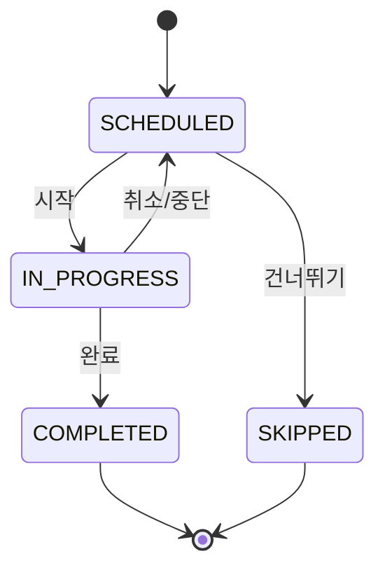
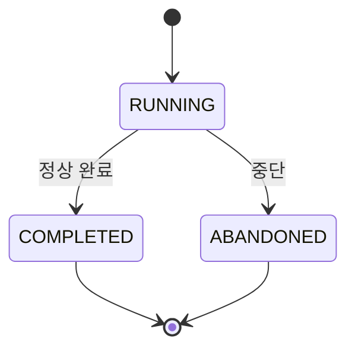

# ADR 0003: Session과 Session Run 분리

## 상태

**확정** (2025-12)

---

## 컨텍스트

학습 세션은 두 가지 측면을 가집니다:

1. **스케줄 측면**: "언제, 무엇을 학습할 것인가" (Plan 기반)
2. **실행 측면**: "실제로 언제 시작하고, 어떻게 진행되었는가"

이 두 측면을 하나의 엔티티로 관리하면 다음 문제가 발생합니다:

- 세션을 여러 번 시도할 수 있음 (중단 후 재시작)
- 스케줄과 실행 상태가 혼재
- 상태 머신 복잡도 증가

---

## 결정

**Session(스케줄)과 Session Run(실행)을 분리**합니다.

### 엔티티 정의

```
plan_sessions (스케줄)
├── id
├── plan_id
├── module_id
├── session_type (LEARN)
├── scheduled_for_date
├── status (SCHEDULED / IN_PROGRESS / COMPLETED / SKIPPED)
└── ...

session_runs (실행 기록)
├── id
├── session_id (FK → plan_sessions)
├── status (RUNNING / COMPLETED / ABANDONED)
├── started_at
├── ended_at
├── exit_reason
└── ...
```

---

## 상태 머신

### Session (스케줄) 상태



### Session Run (실행) 상태



---

## 근거

### 채택 이유

1. **다중 시도 지원**
   - 사용자가 세션을 중단하고 다시 시도 가능
   - 각 시도는 별도의 Session Run으로 기록

2. **상태 분리**
   - 스케줄 상태: "오늘 해야 할 일인가?"
   - 실행 상태: "지금 진행 중인가?"

3. **복구 지원**
   - RUNNING 상태의 Run이 있으면 복구 대상
   - 여러 Run 중 마지막 기록 조회 용이

4. **분석 용이**
   - 세션별 시도 횟수
   - 중단 사유 분석
   - 평균 학습 시간 계산

### 대안 검토

| 옵션            | 설명                 | 결과             |
| --------------- | -------------------- | ---------------- |
| 통합 엔티티     | 하나의 테이블로 관리 | 기각 - 상태 복잡 |
| 이력 테이블     | 별도 히스토리 테이블 | 기각 - 관계 복잡 |
| **분리 엔티티** | Session + Run 분리   | **채택**         |

---

## 구현 지침

### 세션 시작

```typescript
async function startSession(sessionId: string, userId: string) {
  // 1. 세션 상태 확인
  const session = await db
    .select()
    .from(planSessions)
    .where(eq(planSessions.id, sessionId))
    .limit(1);

  if (session[0].status === "COMPLETED") {
    throw new Error("이미 완료된 세션입니다");
  }

  // 2. 진행 중인 Run 확인 (복구 대상)
  const existingRun = await db
    .select()
    .from(sessionRuns)
    .where(
      and(
        eq(sessionRuns.sessionId, sessionId),
        eq(sessionRuns.status, "RUNNING"),
      ),
    )
    .limit(1);

  if (existingRun.length > 0) {
    return { run: existingRun[0], isRecovery: true };
  }

  // 3. 새 Run 생성
  const [run] = await db
    .insert(sessionRuns)
    .values({
      sessionId,
      userId,
      status: "RUNNING",
      startedAt: new Date(),
    })
    .returning();

  // 4. 세션 상태 업데이트
  await db
    .update(planSessions)
    .set({ status: "IN_PROGRESS" })
    .where(eq(planSessions.id, sessionId));

  return { run, isRecovery: false };
}
```

### 세션 완료

```typescript
async function completeSession(runId: string) {
  const [run] = await db
    .update(sessionRuns)
    .set({ status: "COMPLETED", endedAt: new Date() })
    .where(eq(sessionRuns.id, runId))
    .returning();

  await db
    .update(planSessions)
    .set({ status: "COMPLETED", completedAt: new Date() })
    .where(eq(planSessions.id, run.sessionId));

  // 요약 생성 등 후처리
  await postSessionProcessing(run);
}
```

### 세션 중단

```typescript
async function abandonSession(runId: string, reason: string) {
  await db
    .update(sessionRuns)
    .set({
      status: "ABANDONED",
      endedAt: new Date(),
      exitReason: reason,
    })
    .where(eq(sessionRuns.id, runId));

  // 세션은 SCHEDULED로 복귀 (다시 시도 가능)
  const run = await db
    .select()
    .from(sessionRuns)
    .where(eq(sessionRuns.id, runId))
    .limit(1);

  await db
    .update(planSessions)
    .set({ status: "SCHEDULED" })
    .where(eq(planSessions.id, run[0].sessionId));
}
```

---

## 복구 정책

### 복구 조건

1. 사용자가 `/session` 진입
2. 해당 사용자의 RUNNING 상태 Run 존재
3. 마지막 스냅샷 시간이 24시간 이내

### 복구 로직

```typescript
async function checkRecovery(userId: string) {
  const runningRun = await db
    .select()
    .from(sessionRuns)
    .innerJoin(planSessions, eq(sessionRuns.sessionId, planSessions.id))
    .where(
      and(eq(sessionRuns.userId, userId), eq(sessionRuns.status, "RUNNING")),
    )
    .limit(1);

  if (runningRun.length === 0) return null;

  // 24시간 초과 시 자동 중단
  const lastActivity = runningRun[0].session_runs.startedAt;
  if (dayjs().diff(lastActivity, "hour") > 24) {
    await abandonSession(runningRun[0].session_runs.id, "TIMEOUT");
    return null;
  }

  return runningRun[0];
}
```

---

## 결과

### 긍정적

- 상태 머신 단순화
- 학습 시도 이력 보존
- 복구 로직 명확

### 부정적

- 테이블 추가로 JOIN 필요
- 약간의 복잡도 증가

---

## 관련 문서

- [데이터 모델](../data-models.md)
- [풀스크린 학습 세션](../../03-product/pages/learning-session.md)
- [Sessions API](../api/sessions.md)
