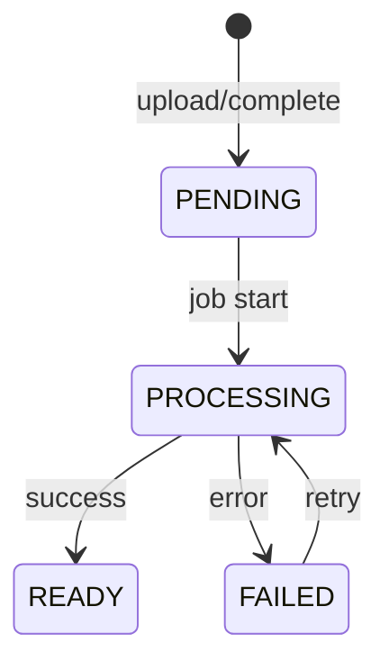

# Materials 시스템

학습 자료의 처리 파이프라인, 상태 전이, 업로드 전략을 설명합니다.

**API 상세**: [Scalar 문서](/docs)에서 `/api/materials/*`, `/api/jobs/*` 확인

---

## 개념

UI에서는 "Documents", 백엔드/API에서는 "Materials"로 명명.

| 속성               | 설명                                |
| ------------------ | ----------------------------------- |
| sourceType         | FILE (업로드), TEXT (직접 입력)     |
| processingStatus   | PENDING → PROCESSING → READY/FAILED |
| processingProgress | 처리 진행률 (0-100)                 |
| processingStep     | 현재 처리 단계 (SSE 이벤트와 동일)  |
| processingError    | 실패 시 에러 메시지                 |

---

## 처리 파이프라인

```
[업로드] → [저장] → [텍스트 추출] → [청크 분할] → [임베딩] → [READY]
                              ↓
                           [FAILED]
```

| 단계           | 작업                           | 실패 시         |
| -------------- | ------------------------------ | --------------- |
| 1. 업로드      | Presigned URL로 R2 직접 업로드 | 재시도          |
| 2. 텍스트 추출 | PDF/DOCX/MD 등에서 텍스트 파싱 | FAILED          |
| 3. 청크 분할   | 문맥 단위로 분할               | -               |
| 4. 임베딩      | AI 임베딩 생성                 | FAILED (재시도) |
| 5. 완료        | READY 상태 변경                | -               |

---

## 상태 전이



| 상태       | 설명                 | 전이 가능           |
| ---------- | -------------------- | ------------------- |
| PENDING    | 업로드 완료, 대기    | PROCESSING          |
| PROCESSING | 분석 중              | READY, FAILED       |
| READY      | 분석 완료, 사용 가능 | -                   |
| FAILED     | 분석 실패            | PROCESSING (재시도) |

**재시도**: 자동 3회, 그 후 수동 재시도 버튼 제공

---

## 업로드 전략

### Presigned URL 방식

대용량 파일 업로드를 위한 3단계 플로우:

```
1. init     →  uploadId, presigned URL 발급
2. upload   →  클라이언트가 R2로 직접 업로드
3. complete →  백엔드에서 처리 시작
```

**장점**: 서버 메모리 부하 감소, 업로드 재개 가능

### 제약

| 항목               | 제한               | 사유                |
| ------------------ | ------------------ | ------------------- |
| 파일 크기          | 50MB               | 처리 시간/비용 균형 |
| 지원 형식          | PDF, MD, TXT, DOCX | 텍스트 추출 가능    |
| Presigned URL 만료 | 1시간              | 보안                |

---

## 텍스트 입력 처리

사용자가 직접 입력한 텍스트:

1. 클라이언트에서 `.txt` 파일 생성
2. 동일한 업로드 플로우 사용
3. 백엔드에서 `sourceType: TEXT`로 저장

**근거**: 처리 파이프라인 통일, 코드 단순화

---

## 실시간 진행 상황 (SSE)

업로드 및 처리 진행 상황을 실시간으로 받을 수 있습니다:

```
POST /api/materials/uploads/complete/stream
```

**SSE 이벤트 타입**:

| 이벤트     | 설명               |
| ---------- | ------------------ |
| `progress` | 진행 상황 업데이트 |
| `complete` | 처리 완료          |
| `error`    | 에러 발생          |

**Progress 단계**:

| 단계       | 설명                |
| ---------- | ------------------- |
| PREPARING  | 업로드 준비 중      |
| VERIFYING  | 파일 확인 중        |
| LOADING    | 파일 불러오는 중    |
| CHECKING   | 기존 자료와 비교 중 |
| STORING    | 파일 저장 중        |
| ANALYZING  | 학습 자료 분석 중   |
| FINALIZING | 마무리 중           |
| COMPLETED  | 완료                |
| FAILED     | 실패                |

## 폴링 전략 (Fallback)

SSE를 사용할 수 없는 경우 폴링으로 대체:

```typescript
async function pollMaterialStatus(materialId: string) {
  while (true) {
    const { data } = await api.get(`/api/materials/${materialId}`);

    if (data.processingStatus === "READY") return data;
    if (data.processingStatus === "FAILED")
      throw new Error(data.processingError);

    await sleep(3000); // 3초 간격
  }
}
```

---

## 삭제 정책

```
DELETE /api/materials/{materialId}
```

### Soft vs Hard Delete

| 상황             | 삭제 타입 | 설명                      |
| ---------------- | --------- | ------------------------- |
| Plan에서 참조 중 | Soft      | "목록에서 삭제됨" 메시지  |
| 참조 없음        | Hard      | 완전 삭제, R2 파일도 삭제 |

### GC (가비지 컬렉션)

참조되지 않는 soft-deleted Material:

- 30일 후 하드 삭제 검토
- 참조 카운트 기반

**상세**: [학습 자료 삭제 정책](../policies/material-deletion.md)

---

## 에러 코드

| 코드                      | HTTP | 상황           | 처리           |
| ------------------------- | ---- | -------------- | -------------- |
| MATERIAL_NOT_FOUND        | 404  | 자료 없음      | 404 페이지     |
| MATERIAL_NOT_READY        | 400  | 분석 미완료    | 대기 안내      |
| MATERIAL_FILE_TOO_LARGE   | 400  | 50MB 초과      | 크기 제한 안내 |
| MATERIAL_UNSUPPORTED_TYPE | 400  | 지원 불가 형식 | 형식 안내      |

---

## 관련 문서

- [학습 자료 삭제 정책](../policies/material-deletion.md)
- [Ingestion Pipeline](../backend/ingestion-pipeline.md)
- [Documents 페이지](../../03-product/pages/documents.md)
