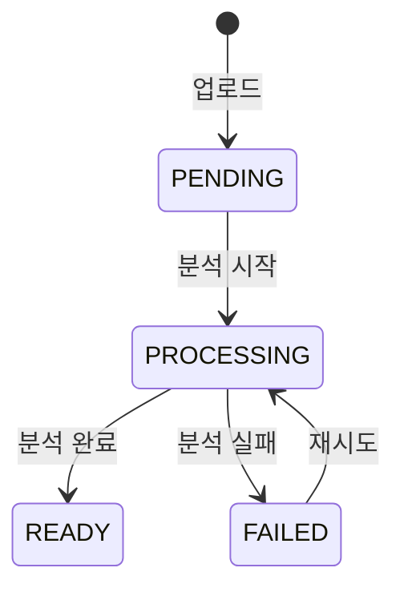

# Materials API

## 개요

학습 자료(Documents)의 업로드, 조회, 삭제 API입니다. UI에서는 "Documents", 백엔드에서는 "Materials"로 명명됩니다.

---

## 엔드포인트

### 자료 목록 조회

```
GET /api/spaces/{spaceId}/materials
```

**Query Parameters**:

| 파라미터 | 타입   | 기본값         | 설명                                     |
| -------- | ------ | -------------- | ---------------------------------------- |
| page     | number | 1              | 페이지 번호                              |
| limit    | number | 20             | 페이지당 개수 (최대 100)                 |
| status   | string | -              | 필터: PENDING, PROCESSING, READY, FAILED |
| search   | string | -              | 제목 검색                                |
| sort     | string | createdAt:desc | 정렬                                     |

**Response** (200):

```json
{
  "data": [
    {
      "id": "uuid",
      "title": "React Hooks 완벽 가이드",
      "sourceType": "FILE",
      "mimeType": "application/pdf",
      "fileSize": 1024000,
      "processingStatus": "READY",
      "summary": "React Hooks의 기본 개념과 활용법을 다룹니다.",
      "tags": ["react", "hooks"],
      "createdAt": "2025-01-15T09:00:00Z"
    }
  ],
  "meta": {
    "total": 15,
    "page": 1,
    "limit": 20,
    "totalPages": 1
  }
}
```

---

### 자료 상세 조회

```
GET /api/materials/{materialId}
```

**Response** (200):

```json
{
  "data": {
    "id": "uuid",
    "spaceId": "uuid",
    "title": "React Hooks 완벽 가이드",
    "sourceType": "FILE",
    "originalFilename": "react-hooks-guide.pdf",
    "mimeType": "application/pdf",
    "fileSize": 1024000,
    "processingStatus": "READY",
    "processedAt": "2025-01-15T09:05:00Z",
    "summary": "React Hooks의 기본 개념과 활용법을 다룹니다.",
    "tags": ["react", "hooks"],
    "chunkCount": 42,
    "createdAt": "2025-01-15T09:00:00Z",
    "updatedAt": "2025-01-15T09:05:00Z"
  }
}
```

---

### 파일 업로드 (Presigned URL 방식)

자료 생성은 **파일 업로드 방식만** 지원합니다. 텍스트 자료는 `.txt`/`.md` 파일로 업로드합니다.

대용량 파일 업로드를 위한 **2개의 API 호출 + 1개의 직접 업로드** 플로우입니다.

#### 1단계: 업로드 세션 시작

```
POST /api/spaces/{spaceId}/materials/uploads/init
```

**Request** (application/json):

| 필드             | 타입   | 필수 | 설명                  |
| ---------------- | ------ | ---- | --------------------- |
| originalFilename | string | 필수 | 원본 파일명           |
| mimeType         | string | 필수 | MIME 타입             |
| fileSize         | number | 필수 | 파일 크기 (최대 50MB) |

**Response** (200):

```json
{
  "data": {
    "uploadId": "uuid",
    "objectKey": "uploads/...",
    "uploadUrl": "https://r2.cloudflarestorage.com/...",
    "method": "PUT",
    "headers": { "Content-Type": "application/pdf" },
    "expiresAt": "2025-01-15T10:00:00Z"
  }
}
```

#### 2단계: Presigned URL로 파일 직접 업로드 (R2)

1단계 응답의 `uploadUrl`, `method`, `headers`를 그대로 사용해 **브라우저/클라이언트가 스토리지(R2)로 직접 업로드**합니다.

- 업로드 요청은 `multipart/form-data`가 아니라 **파일 바이너리 자체를 PUT**하는 방식입니다.
- `headers`에 포함된 헤더(특히 `Content-Type`)는 **반드시 동일하게** 전송해야 합니다. (서명에 포함되어 불일치 시 `403`이 발생할 수 있습니다)
- 업로드 성공 시 응답 헤더의 `ETag`를 받을 수 있으며, 3단계에서 `etag`로 전달하면 무결성 검증에 사용됩니다. (선택)
- `expiresAt` 이전에 업로드/완료 처리까지 마쳐야 합니다. (만료 시 1단계를 다시 호출)

**예시 (curl)**:

```bash
curl -X PUT \
  -H "Content-Type: application/pdf" \
  --upload-file "./react-hooks-guide.pdf" \
  "https://r2.cloudflarestorage.com/...presigned..."
```

**예시 (브라우저 fetch)**:

```ts
const init = await api.post(`/spaces/${spaceId}/materials/uploads/init`, {
  originalFilename: file.name,
  mimeType: file.type || "application/octet-stream",
  fileSize: file.size,
});

const { uploadId, uploadUrl, method, headers } = init.data.data;

const uploadRes = await fetch(uploadUrl, {
  method,
  headers,
  body: file,
});
if (!uploadRes.ok) throw new Error("Failed to upload file to R2");

const etag = uploadRes.headers.get("etag") ?? undefined;

await api.post(`/spaces/${spaceId}/materials/uploads/complete`, {
  uploadId,
  etag,
});
```

> 브라우저에서 `etag`를 읽으려면 R2 CORS 설정에 `ExposeHeaders: ETag`가 필요할 수 있습니다. 읽을 수 없다면 `etag` 없이 3단계를 호출해도 됩니다.

#### 3단계: 업로드 완료 처리

클라이언트가 `uploadUrl`로 파일을 직접 업로드한 후 호출합니다.

```
POST /api/spaces/{spaceId}/materials/uploads/complete
```

**Request** (application/json):

| 필드     | 타입   | 필수 | 설명                              |
| -------- | ------ | ---- | --------------------------------- |
| uploadId | string | 필수 | 1단계에서 받은 uploadId           |
| title    | string | 선택 | 자료 제목 (미입력 시 파일명 사용) |
| etag     | string | 선택 | 업로드 응답에서 받은 ETag         |

**제약 조건**:

- 파일 크기: 최대 50MB
- 지원 형식: PDF, .md, .txt, .docx
- `sourceType` 저장 규칙: PDF/DOCX → `FILE`, TXT/MD → `TEXT`

**Response** (201/202): 동기 처리 시 `201`, 비동기 처리 시 `202`를 반환합니다.

---

### 처리 상태 조회 (비동기)

```
GET /api/jobs/{jobId}
```

**Response** (200):

```json
{
  "data": {
    "jobId": "uuid",
    "status": "RUNNING",
    "progress": 0.65,
    "currentStep": "embedding",
    "result": null
  }
}
```

**status 값**:

| 값        | 설명    |
| --------- | ------- |
| QUEUED    | 대기 중 |
| RUNNING   | 처리 중 |
| SUCCEEDED | 성공    |
| FAILED    | 실패    |

---

### 자료 삭제

```
DELETE /api/materials/{materialId}
```

**Response** (200) - Soft Delete:

```json
{
  "message": "목록에서 삭제되었습니다. (진행 중인 학습을 위해 데이터는 유지됩니다.)",
  "data": {
    "type": "soft"
  }
}
```

**Response** (200) - Hard Delete:

```json
{
  "message": "삭제되었습니다.",
  "data": {
    "type": "hard"
  }
}
```

> 삭제 정책 상세: [학습 자료 삭제 정책](../policies/material-deletion.md)

---

### 자료 제목 수정

```
PATCH /api/materials/{materialId}
```

**Request Body**:

```json
{
  "title": "React Hooks 완벽 정복"
}
```

**Response** (200):

```json
{
  "data": {
    "id": "uuid",
    "title": "React Hooks 완벽 정복",
    "updatedAt": "2025-01-16T10:00:00Z"
  }
}
```

---

## processing_status 상태 전이



---

## 대용량 처리 전략

### 폴링 방식

```typescript
// 클라이언트
async function uploadWithPolling(file: File, spaceId: string) {
  const { data } = await api.post(`/spaces/${spaceId}/materials`, { file });

  if (data.processingStatus === "READY") {
    return data;
  }

  // 폴링
  return pollJobStatus(data.jobId);
}

async function pollJobStatus(jobId: string) {
  while (true) {
    const { data } = await api.get(`/jobs/${jobId}`);

    if (data.status === "SUCCEEDED") {
      return data.result;
    }
    if (data.status === "FAILED") {
      throw new Error(data.error.message);
    }

    await sleep(3000); // 3초 대기
  }
}
```

### SSE 방식 (향후)

```
GET /api/jobs/{jobId}/stream
```

```
event: progress
data: {"progress": 0.5, "step": "chunking"}

event: progress
data: {"progress": 0.8, "step": "embedding"}

event: complete
data: {"materialId": "uuid", "status": "READY"}
```

---

## 에러 코드

| 코드                      | HTTP | 설명                                  |
| ------------------------- | ---- | ------------------------------------- |
| MATERIAL_NOT_FOUND        | 404  | 자료 없음                             |
| MATERIAL_NOT_READY        | 400  | 분석 미완료 상태에서 Plan에 사용 시도 |
| MATERIAL_FILE_TOO_LARGE   | 400  | 파일 크기 초과 (50MB)                 |
| MATERIAL_UNSUPPORTED_TYPE | 400  | 지원하지 않는 파일 형식               |
| MATERIAL_PARSE_FAILED     | 500  | 텍스트 추출 실패                      |
| MATERIAL_EMBED_FAILED     | 500  | 임베딩 생성 실패                      |

---

## 스키마

```typescript
// URL 수집 Request
const CreateMaterialFromUrlSchema = z.object({
  url: z.url(),
  title: z.string().max(200).optional(),
});

// 텍스트 입력 Request
const CreateMaterialFromTextSchema = z.object({
  text: z.string().min(10).max(100000),
  title: z.string().max(200).optional(),
});

// 파일 업로드 시작 Request
const InitiateMaterialUploadSchema = z.object({
  originalFilename: z.string().min(1).max(255),
  mimeType: z.string().min(1).max(255),
  fileSize: z
    .number()
    .int()
    .positive()
    .max(50 * 1024 * 1024),
});

// 파일 업로드 완료 Request
const CompleteMaterialUploadSchema = z.object({
  uploadId: z.string().uuid(),
  title: z.string().max(200).optional(),
  etag: z.string().min(1).optional(),
});

// Response
const MaterialSchema = z.object({
  id: z.string().uuid(),
  spaceId: z.string().uuid(),
  title: z.string(),
  sourceType: z.enum(["FILE", "URL", "TEXT"]),
  processingStatus: z.enum(["PENDING", "PROCESSING", "READY", "FAILED"]),
  summary: z.string().nullable(),
  tags: z.array(z.string()),
  createdAt: z.string().datetime(),
  updatedAt: z.string().datetime(),
});
```

---

## 관련 문서

- [API 개요](./overview.md)
- [Documents 페이지](../../03-product/pages/documents.md)
- [학습 자료 삭제 정책](../policies/material-deletion.md)
- [Ingestion Pipeline](../backend/ingestion-pipeline.md)
