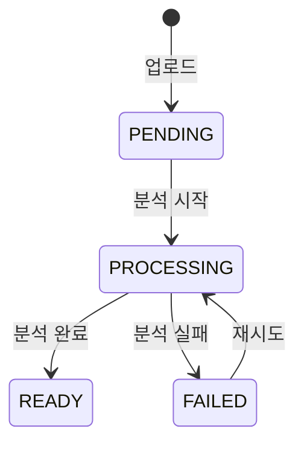

# Materials API

## 개요

학습 자료(Documents)의 업로드, 조회, 삭제 API입니다. UI에서는 "Documents", 백엔드에서는 "Materials"로 명명됩니다.

---

## 엔드포인트

### 자료 목록 조회

```
GET /api/v1/spaces/{spaceId}/materials
```

**Query Parameters**:
| 파라미터 | 타입 | 기본값 | 설명 |
|---------|------|-------|------|
| page | number | 1 | 페이지 번호 |
| limit | number | 20 | 페이지당 개수 (최대 100) |
| status | string | - | 필터: PENDING, PROCESSING, READY, FAILED |
| search | string | - | 제목 검색 |
| sort | string | createdAt:desc | 정렬 |

**Response** (200):

```json
{
  "data": [
    {
      "id": "uuid",
      "title": "React Hooks 완벽 가이드",
      "sourceType": "FILE",
      "mimeType": "application/pdf",
      "fileSize": 1024000,
      "processingStatus": "READY",
      "summary": "React Hooks의 기본 개념과 활용법을 다룹니다.",
      "tags": ["react", "hooks"],
      "createdAt": "2025-01-15T09:00:00Z"
    }
  ],
  "meta": {
    "total": 15,
    "page": 1,
    "limit": 20,
    "totalPages": 1
  }
}
```

---

### 자료 상세 조회

```
GET /api/v1/materials/{materialId}
```

**Response** (200):

```json
{
  "data": {
    "id": "uuid",
    "spaceId": "uuid",
    "title": "React Hooks 완벽 가이드",
    "sourceType": "FILE",
    "originalFilename": "react-hooks-guide.pdf",
    "mimeType": "application/pdf",
    "fileSize": 1024000,
    "processingStatus": "READY",
    "processedAt": "2025-01-15T09:05:00Z",
    "summary": "React Hooks의 기본 개념과 활용법을 다룹니다.",
    "tags": ["react", "hooks"],
    "chunkCount": 42,
    "createdAt": "2025-01-15T09:00:00Z",
    "updatedAt": "2025-01-15T09:05:00Z"
  }
}
```

---

### 자료 업로드

```
POST /api/v1/spaces/{spaceId}/materials
```

**Request** (multipart/form-data):

| 필드  | 타입   | 필수   | 설명                       |
| ----- | ------ | ------ | -------------------------- |
| file  | File   | 조건부 | 파일 업로드 시             |
| url   | string | 조건부 | URL 입력 시                |
| text  | string | 조건부 | 텍스트 입력 시             |
| title | string | 선택   | 제목 (미입력 시 자동 추출) |

**제약 조건**:

- file, url, text 중 하나만 필수
- 파일 크기: 최대 50MB
- 지원 형식: PDF, .md, .txt, .doc, .docx

**Response** (201) - 동기 처리:

```json
{
  "data": {
    "id": "uuid",
    "title": "React Hooks 완벽 가이드",
    "processingStatus": "READY",
    "summary": "React Hooks의 기본 개념과 활용법을 다룹니다."
  }
}
```

**Response** (202) - 비동기 처리:

```json
{
  "data": {
    "id": "uuid",
    "jobId": "uuid",
    "processingStatus": "PROCESSING"
  }
}
```

---

### 처리 상태 조회 (비동기)

```
GET /api/v1/jobs/{jobId}
```

**Response** (200):

```json
{
  "data": {
    "jobId": "uuid",
    "status": "RUNNING",
    "progress": 0.65,
    "currentStep": "embedding",
    "result": null
  }
}
```

**status 값**:
| 값 | 설명 |
|----|------|
| QUEUED | 대기 중 |
| RUNNING | 처리 중 |
| SUCCEEDED | 성공 |
| FAILED | 실패 |

---

### 자료 삭제

```
DELETE /api/v1/materials/{materialId}
```

**Response** (200) - Soft Delete:

```json
{
  "message": "목록에서 삭제되었습니다. (진행 중인 학습을 위해 데이터는 유지됩니다.)",
  "data": {
    "type": "soft"
  }
}
```

**Response** (200) - Hard Delete:

```json
{
  "message": "삭제되었습니다.",
  "data": {
    "type": "hard"
  }
}
```

> 삭제 정책 상세: [학습 자료 삭제 정책](../policies/material-deletion.md)

---

### 자료 제목 수정

```
PATCH /api/v1/materials/{materialId}
```

**Request Body**:

```json
{
  "title": "React Hooks 완벽 정복"
}
```

**Response** (200):

```json
{
  "data": {
    "id": "uuid",
    "title": "React Hooks 완벽 정복",
    "updatedAt": "2025-01-16T10:00:00Z"
  }
}
```

---

## processing_status 상태 전이



---

## 대용량 처리 전략

### 폴링 방식

```typescript
// 클라이언트
async function uploadWithPolling(file: File, spaceId: string) {
  const { data } = await api.post(`/spaces/${spaceId}/materials`, { file });

  if (data.processingStatus === "READY") {
    return data;
  }

  // 폴링
  return pollJobStatus(data.jobId);
}

async function pollJobStatus(jobId: string) {
  while (true) {
    const { data } = await api.get(`/jobs/${jobId}`);

    if (data.status === "SUCCEEDED") {
      return data.result;
    }
    if (data.status === "FAILED") {
      throw new Error(data.error.message);
    }

    await sleep(3000); // 3초 대기
  }
}
```

### SSE 방식 (향후)

```
GET /api/v1/jobs/{jobId}/stream
```

```
event: progress
data: {"progress": 0.5, "step": "chunking"}

event: progress
data: {"progress": 0.8, "step": "embedding"}

event: complete
data: {"materialId": "uuid", "status": "READY"}
```

---

## 에러 코드

| 코드                      | HTTP | 설명                                  |
| ------------------------- | ---- | ------------------------------------- |
| MATERIAL_NOT_FOUND        | 404  | 자료 없음                             |
| MATERIAL_NOT_READY        | 400  | 분석 미완료 상태에서 Plan에 사용 시도 |
| MATERIAL_FILE_TOO_LARGE   | 400  | 파일 크기 초과 (50MB)                 |
| MATERIAL_UNSUPPORTED_TYPE | 400  | 지원하지 않는 파일 형식               |
| MATERIAL_PARSE_FAILED     | 500  | 텍스트 추출 실패                      |
| MATERIAL_EMBED_FAILED     | 500  | 임베딩 생성 실패                      |

---

## 스키마

```typescript
// Request
const CreateMaterialSchema = z
  .object({
    title: z.string().max(200).optional(),
  })
  .and(
    z.union([
      z.object({ file: z.instanceof(File) }),
      z.object({ url: z.string().url() }),
      z.object({ text: z.string().min(10).max(100000) }),
    ]),
  );

// Response
const MaterialSchema = z.object({
  id: z.string().uuid(),
  spaceId: z.string().uuid(),
  title: z.string(),
  sourceType: z.enum(["FILE", "URL", "TEXT"]),
  processingStatus: z.enum(["PENDING", "PROCESSING", "READY", "FAILED"]),
  summary: z.string().nullable(),
  tags: z.array(z.string()),
  createdAt: z.string().datetime(),
  updatedAt: z.string().datetime(),
});
```

---

## 관련 문서

- [API 개요](./overview.md)
- [Documents 페이지](../../03-product/pages/documents.md)
- [학습 자료 삭제 정책](../policies/material-deletion.md)
- [Ingestion Pipeline](../backend/ingestion-pipeline.md)
