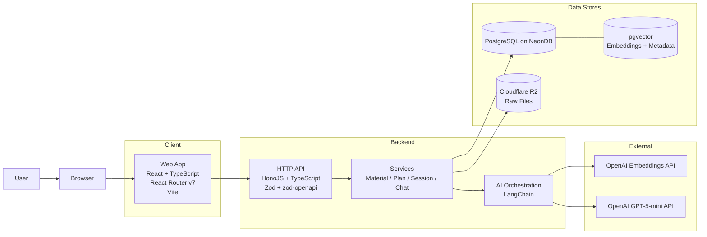
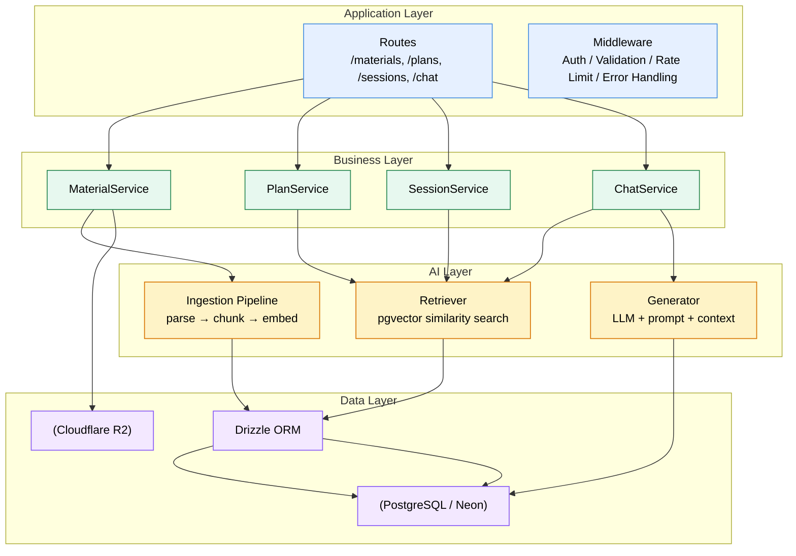
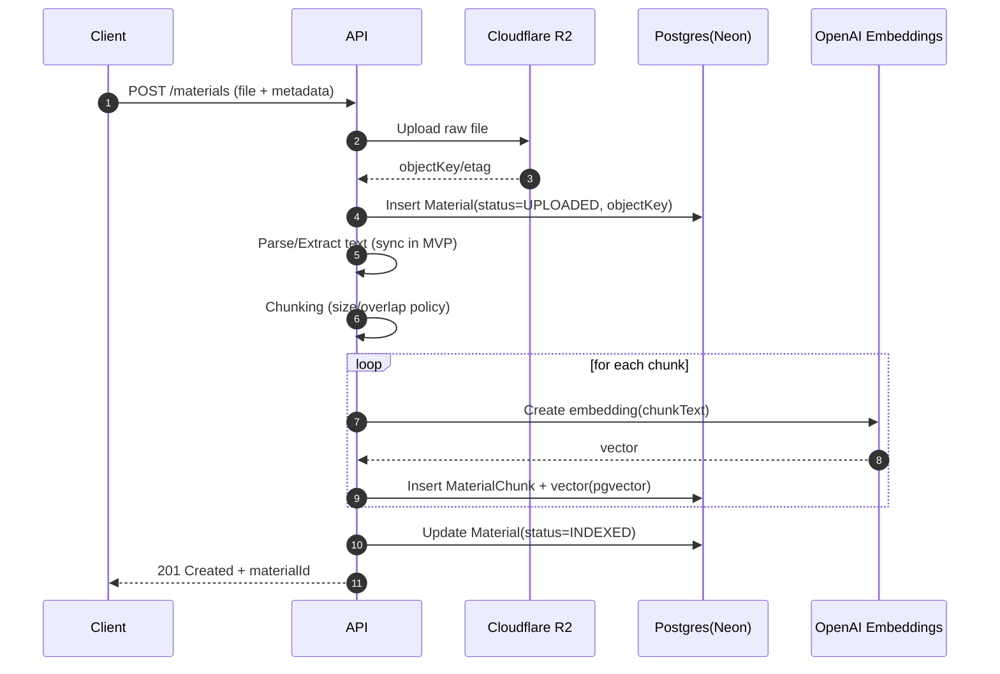
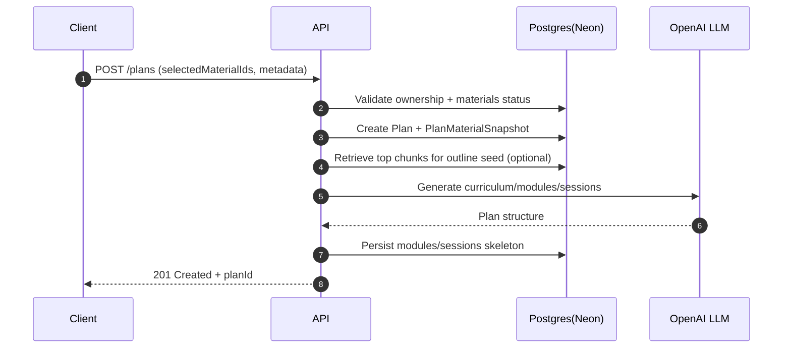
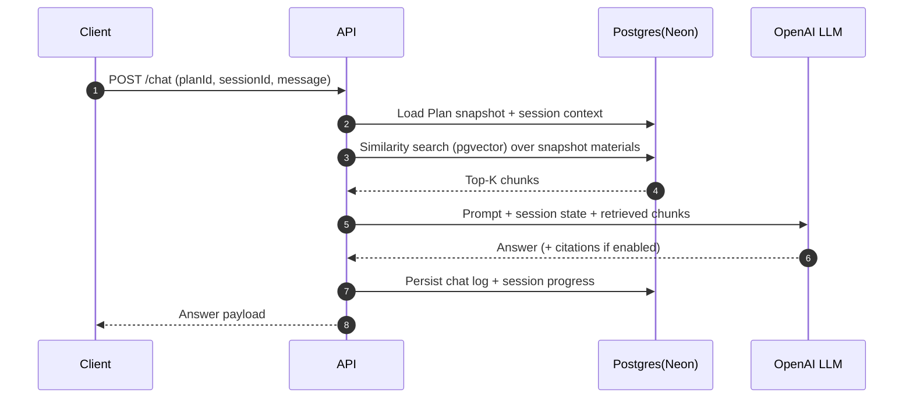
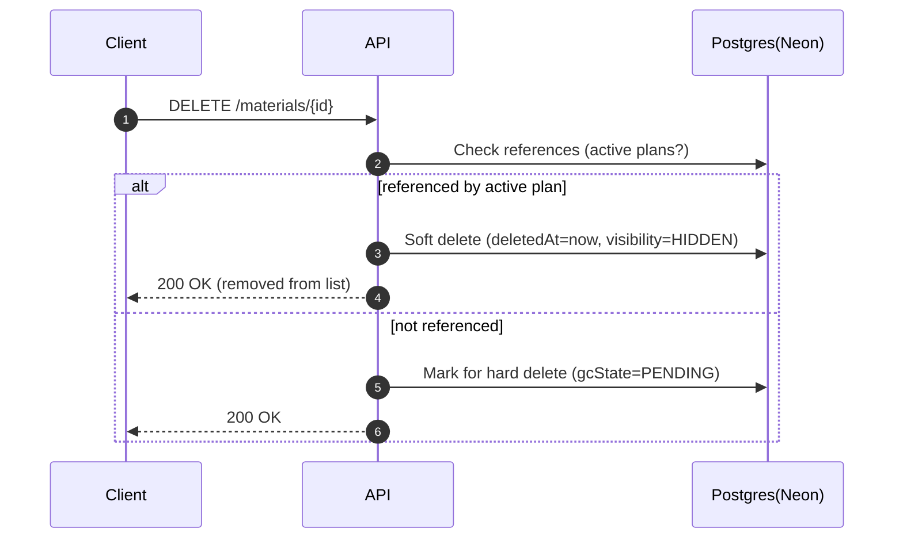
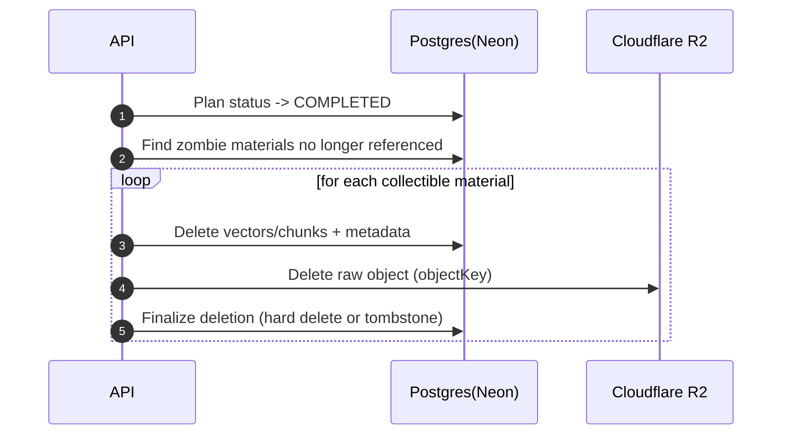

# 시스템 아키텍처

## 0. 문서 목적과 범위

이 문서는 **AI 개인화 학습 플랫폼(Learning OS)** 의 구현 관점에서 **전체 시스템 구조(컨테이너/런타임 경계), 주요 컴포넌트 책임, 핵심 데이터/AI 흐름, 확장 포인트**를 정의합니다.

- **대상 독자**: 프론트엔드/백엔드 개발자, 신규 기여자, 설계 리뷰어
- **포함**: 런타임 구성, 모듈 경계, 데이터 저장 전략, RAG 파이프라인, 삭제/정리 정책(좀비 데이터 연계)
- **비포함**: 엔드포인트별 상세 스펙(별도 API 문서), UI/UX 세부(03-product), ERD 상세(04-engineering/data-models)

---

## 1. 아키텍처 원칙

### 1.1. 제품/기술 원칙

1. **단순성 우선**: 사용자에게 노출되는 개념은 최소화하고, 복잡도는 시스템 내부에서 흡수합니다.
2. **재현 가능한 학습 경험**: Plan은 생성 시점의 문서 조합/스냅샷을 기반으로 동작하여, 이후 문서 추가/변경으로 흔들리지 않습니다.
3. **타입 안전성과 계약 중심 개발**: TypeScript를 중심으로 프론트–백–DB–AI가 일관된 계약(Zod/OpenAPI)을 공유합니다.
4. **MVP는 동기 처리, 확장은 비동기**: 초기에는 구현 단순성을 위해 동기 파이프라인을 채택하되, 병목 지점은 비동기 잡으로 자연스럽게 확장 가능해야 합니다.

### 1.2. 핵심 도메인 용어 정리

- **Material(학습 자료)**: 사용자가 업로드하거나 입력한 모든 학습 소스.
- **Plan**: 선택된 Material 스냅샷 기반의 학습 실행 단위 (Icon, Color 등 UI 속성 포함)
- **Session**: Plan 내부의 몰입형 학습 단위(20~40분)

---

## 2. 시스템 컨테이너 구조(Top-level)

### 2.1. 책임 분리 요약

- **Client**: 학습 경험(세션 몰입), 데이터 조회/입력, 업로드 UI, 상태/캐시 관리
- **Backend API**: 인증/인가, 입력 검증, 트랜잭션 경계, 도메인 규칙 실행, AI 파이프라인 호출
- **PostgreSQL(Neon)**: 핵심 엔티티(Plans/Sessions/Materials) 및 운영 메타데이터
- **pgvector**: 임베딩 벡터 및 검색용 인덱스(문서 청크 기반)
- **R2**: 원본 파일(PDF 등) 저장, 다운로드/미리보기용 서명 URL 제공 가능
- **OpenAI**: 임베딩 생성 및 LLM 응답 생성
- **LangChain**: RAG 체인 구성(리트리버/프롬프트/후처리), 확장 가능한 오케스트레이션 계층

---

## 3. 백엔드 내부 아키텍처(레이어/모듈)

백엔드는 **요청 처리(라우팅)** 와 **비즈니스 로직(서비스)**, **AI 파이프라인**, **데이터 접근 레이어**를 분리합니다.

### 3.1. 권장 레이어 규칙

- **Routes는 얇게**: (1) 인증/인가, (2) Zod 검증, (3) 서비스 호출만 담당
- **서비스가 규칙의 단일 소스**: 삭제 정책(좀비 데이터), Plan 스냅샷 불변성, 소유권 검증 등은 서비스에만 위치
- **AI 파이프라인은 별도 계층**: “LLM 호출 코드”를 서비스에 흩뿌리지 않고, ING/RET/GEN로 구분해 테스트 가능하게 유지

---

## 4. 핵심 데이터/AI 흐름

## 4.1. Material(Document) 업로드 및 인덱싱(ingestion)

목표: 사용자가 업로드한 문서를 **R2에 저장**하고, 검색 가능한 형태로 **청크 + 임베딩 + 벡터 저장(pgvector)** 까지 완료합니다.

**구현 포인트**

- 동기 처리(MVP)에서는 업로드 후 인덱싱까지 한 번에 수행하되, **대용량 문서**는 타임아웃/비용 리스크가 있으므로 7장 “확장”의 비동기 전환 지점을 전제로 설계합니다.
- 청크 테이블은 최소한 다음 메타데이터를 포함하는 것을 권장합니다.
  - `materialId`, `chunkIndex`, `content`, `tokenCount`(선택), `embedding(vector)`, `pageRange`(가능 시)

---

## 4.2. Plan 생성(문서 스냅샷 + 커리큘럼 생성)

Plan은 선택된 Document 집합을 기반으로 생성되며, 이후 Document가 추가/수정되어도 **Plan의 기준은 흔들리지 않아야** 합니다.

**설계 포인트**

- `PlanMaterialSnapshot`(또는 유사 구조)을 통해 **Plan이 참조하는 문서 집합**을 명시적으로 보존합니다.
- 이후 문서 삭제(soft delete)가 발생해도, 진행 중 Plan은 끊기지 않도록 4.4 “좀비 데이터” 규칙과 결합합니다.

---

## 4.3. 세션 진행/AI 대화(RAG)

세션 중 사용자는 질문하거나 시스템이 문제/설명을 제공합니다. 응답은 **Plan 컨텍스트 + 문서 근거**를 기반으로 생성합니다.

**권장 정책**

- **검색 범위 제한**: Plan 스냅샷에 포함된 문서로 리트리벌 범위를 제한하여 “근거 일탈”을 줄입니다.
- **근거 표기 옵션**: MVP에서는 선택 사항으로 두되, 추후 신뢰성 강화를 위해 chunkId 기반 인용(citation)을 지원할 수 있습니다.

---

## 4.4. Document 삭제(좀비 데이터) 및 Garbage Collection

문서 삭제는 “사용자 경험(즉시 목록에서 제거)”과 “시스템 무결성(진행 중 Plan 보호)”이 충돌합니다. 이를 해결하기 위해 **좀비 데이터 전략**을 채택합니다. 상세 정책은 `policies/material-deletion.md`를 따르며, 본 문서는 **아키텍처 관점에서의 흐름**만 요약합니다.

### 4.4.1. 삭제 요청 흐름(Soft delete)

### 4.4.2. GC 흐름(Plan 완료 시 정리)

**정책-구현 연결 포인트**

- “참조 중” 판단은 `PlanMaterialSnapshot` 기반으로 안정적으로 수행합니다.
- GC는 MVP에서 “Plan 완료 시 동기 실행”이 가능하지만, 운영 안정성을 위해 7장에서 비동기 잡 전환을 고려합니다.

---

## 5. 보안/신뢰성 설계(필수 교차 관심사)

## 5.1. 인증/인가

- 로그인 정책(매직링크 + Google OAuth)을 전제로, 백엔드는 다음을 보장해야 합니다.
  - 모든 리소스는 **사용자 소유권** 검증 후 접근 허용(Plan/Material 단위)
  - 세션은 **httpOnly cookie** 또는 동급 보안 수준을 가진 토큰 전략을 권장
  - OAuth redirect는 allowlist 기반으로 제한

## 5.2. 입력 검증과 계약

- 모든 입력은 **Zod 스키마**로 검증하고, 가능한 경우 **zod-openapi**로 스펙을 생성합니다.
- 실패는 일관된 에러 포맷으로 반환(프론트가 예측 가능하게 처리).

## 5.3. 파일 업로드 보안

- MIME/type, 크기 제한, 확장자 제한
- R2 객체 키는 추측 불가능한 형태(UUID 등)
- 다운로드는 서명 URL(또는 백엔드 프록시)로 제한 가능

## 5.4. 운영 관측성(Observability)

- 요청 단위 로그(요청ID/사용자ID/planId 등)와 에러 스택을 남깁니다.
- AI 호출(OpenAI)은 **비용/지연/실패율**이 중요하므로 다음 메트릭을 권장합니다.
  - 임베딩 호출 수/토큰 추정/지연
  - LLM 호출 수/지연/재시도
  - RAG 검색 Top-K 및 hit rate(선택)

---

## 6. 성능 및 비용 설계

### 6.1. 병목 지점

- **인덱싱(임베딩 생성)**: 문서 길이에 선형 비례, 비용/시간 모두 증가
- **LLM 응답**: 컨텍스트 크기 및 호출 빈도에 따라 비용/지연 증가
- **벡터 검색**: 인덱스 설계/Top-K/필터링에 따라 지연 변동

### 6.2. 즉시 적용 가능한 최적화(저비용)

- 청크 크기/오버랩 정책 표준화(재인덱싱 비용 감소)
- Top-K 제한 + 스냅샷 필터링(검색 범위 축소)
- TanStack Query(선택) 기반 클라이언트 캐싱으로 중복 조회 감소
- LLM 호출 전 “사전 분기”(예: 간단한 UI 질문은 LLM 생략) — 필요 시

---

## 7. 확장 아키텍처(로드맵)

## 7.1. 비동기 잡 전환 지점(가장 우선)

다음 흐름은 운영 안정성 관점에서 비동기화 우선순위가 높습니다.

1. **문서 인덱싱**(parse/chunk/embed)
2. **Plan 생성**(대형 문서/복잡 커리큘럼)
3. **Garbage Collection**

전환 방법(권장):

- API는 “요청 접수 → job enqueue → 상태 조회” 패턴으로 변경
- 상태는 DB에 `status`/`progress`로 저장하고, 클라이언트는 폴링 또는 SSE/WS로 반영

## 7.2. 캐시/레이트 리미트

- 고빈도 조회(Plans list 등)는 캐시 계층(예: Redis)을 도입할 수 있습니다.
- LLM/임베딩은 계정 단위 레이트 리미트를 통해 비용 폭주를 방지합니다.

## 7.3. 검색 품질 고도화

- pgvector에 더해 하이브리드 검색(키워드 + 벡터) 또는 재랭킹 도입 가능
- 문서 타입별 파서/청크 전략 분리(PDF, Markdown, Web clip 등)

---

## 8. 관련 문서

- [기술 스택](./tech-stack.md)
- [데이터 모델](./data-models.md)
- [학습 자료 삭제 정책](./policies/material-deletion.md)
- (추가 예정) API 문서: Materials / Plans / Sessions / Chat
