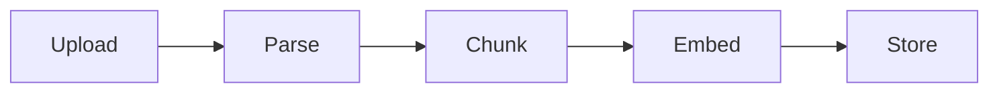

# Ingestion Pipeline

## 개요

문서 업로드 후 parse → chunk → embed 단계별 처리 과정을 정의합니다.

---

## 파이프라인 단계



---

## 1. Parse (텍스트 추출)

### 문서 타입별 파서

| 타입     | 라이브러리 | 출력                 |
| -------- | ---------- | -------------------- |
| PDF      | unpdf      | 텍스트 + 페이지 정보 |
| Markdown | 직접 파싱  | 텍스트 + 헤더 구조   |
| URL      | Cheerio    | 본문 텍스트          |
| 텍스트   | 없음       | 원본                 |

### 메타데이터 추출

```typescript
interface ParseResult {
  text: string;
  pageCount?: number;
  structure?: OutlineNode[];
}
```

---

## 2. Chunk (분할)

### 정책

| 설정      | 값            | 근거               |
| --------- | ------------- | ------------------ |
| 청크 크기 | 500~1000 토큰 | 문맥 유지 + 정밀도 |
| 오버랩    | 100 토큰      | 경계 문맥 보존     |

### 청크 메타데이터

```typescript
interface Chunk {
  ordinal: number;
  content: string;
  tokenCount: number;
  pageStart?: number;
  pageEnd?: number;
  sectionPath?: string;
}
```

---

## 3. Embed (임베딩)

### 모델

- **OpenAI text-embedding-3-small** (MVP)
- 차원: 1536

### 배치 처리

```typescript
async function embedChunks(chunks: Chunk[]) {
  const batchSize = 100;
  for (let i = 0; i < chunks.length; i += batchSize) {
    const batch = chunks.slice(i, i + batchSize);
    const vectors = await openai.embeddings.create({
      model: "text-embedding-3-small",
      input: batch.map((c) => c.content),
    });
    await storeEmbeddings(batch, vectors);
  }
}
```

---

## 4. Store (저장)

### 테이블

- `material_chunks`: 청크 텍스트 + 메타데이터
- `material_embeddings`: 벡터 (pgvector)

---

## 실패/재시도

### 재시도 정책

| 실패 지점        | 재시도 | 동작        |
| ---------------- | ------ | ----------- |
| Parse            | 0회    | 즉시 FAILED |
| Embed (API 오류) | 3회    | 지수 백오프 |
| Store (DB 오류)  | 3회    | 지수 백오프 |

### 부분 성공

임베딩 일부 실패 시 FAILED 처리하고 기존 청크 롤백

---

## 관련 문서

- [Materials API](../api/materials.md)
- [ADR: Ingestion Sync/Async](../adr/0005-ingestion-sync-to-async.md)
