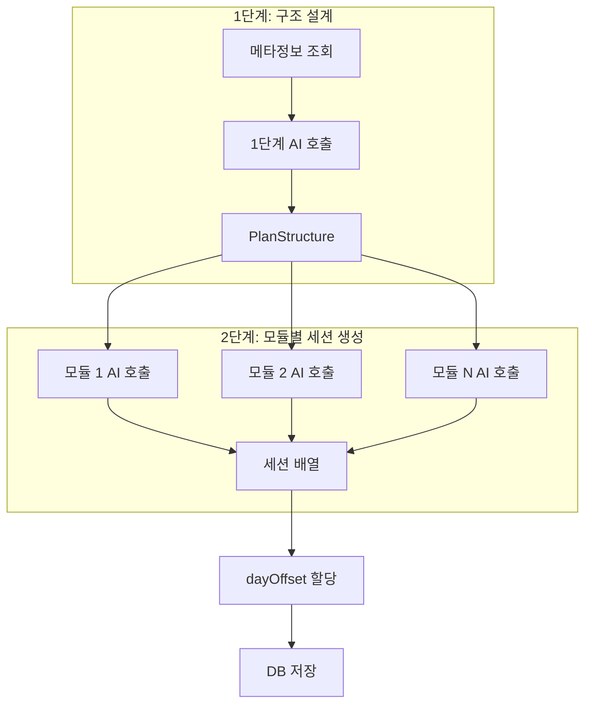

# Plan Generation

## 개요

AI 기반 학습 계획(커리큘럼) 생성 파이프라인입니다.  
**2단계 파이프라인**으로 구성되어 모듈 단위 AI 호출을 통해 효율성과 응집성을 확보합니다.

---

## 입력 스키마

```typescript
interface PlanGenerationInput {
  userId: string;
  materialIds: string[]; // 학습 자료 ID (최소 1개, 최대 5개)
  goalType: "JOB" | "CERT" | "WORK" | "HOBBY" | "OTHER";
  currentLevel: "BEGINNER" | "INTERMEDIATE" | "ADVANCED";
  targetDueDate: Date | null; // null = 학습량에 맞춤
  specialRequirements: string | null;
  requestedSessionCount: number | null; // 사용자 지정 세션 수 (선택)
}
```

---

## 2단계 생성 파이프라인



### 1단계: 구조 설계 (`generatePlanStructure`)

자료 메타정보(청크 수, 문서 구조)를 바탕으로 전체 학습 구조를 설계합니다.

**입력**:

- 자료별 청크 수, outline 정보
- 학습 목표, 수준, 기한

**출력 (PlanStructure)**:

```typescript
interface PlanStructure {
  title: string; // 계획 제목
  summary: string; // 계획 요약
  reasoning: string; // 구성 이유
  modules: Array<{
    title: string;
    description: string;
    orderIndex: number;
    materialIndex: number; // 자료 인덱스
    chunkRange: { start: number; end: number };
    sessionCount: number; // 해당 모듈에 배정될 세션 수 (1-10)
  }>;
}
```

### 2단계: 모듈별 세션 생성 (`populateModuleSessions`)

각 모듈의 청크를 조회하여 **한 번의 AI 호출로 해당 모듈의 모든 세션을 일괄 생성**합니다.

**입력**:

- 모듈 정보 (제목, 설명, sessionCount)
- 모듈 청크 내용

**출력 (ModuleSessions)**:

```typescript
interface ModuleSessions {
  sessions: Array<{
    title: string; // 세션 제목 (120자 이내)
    objective: string; // 학습 목표 (200자 이내)
    estimatedMinutes: number; // 25-50분
    chunkStart: number; // 청크 시작 인덱스 (모듈 내 상대)
    chunkEnd: number; // 청크 끝 인덱스
  }>;
}
```

---

## AI 호출 효율

| 시나리오 | 세션 수 | 모듈 수 | 기존 호출 | 현재 호출 | 감소율 |
| -------- | ------- | ------- | --------- | --------- | ------ |
| 소규모   | 10      | 2       | 11회      | 3회       | 73%    |
| 중규모   | 30      | 4       | 31회      | 5회       | 84%    |
| 대규모   | 60      | 6       | 61회      | 7회       | 89%    |

**계산**: `전체 호출 = 1 (구조 설계) + N (모듈 수)`

---

## 결과 스키마

```typescript
interface GeneratePlanResult {
  title: string;
  summary: string;
  modules: Array<{
    title: string;
    description: string;
    orderIndex: number;
    materialId: string;
  }>;
  sessions: Array<{
    sessionType: "LEARN";
    title: string;
    objective: string;
    estimatedMinutes: number;
    dayOffset: number; // 시작일 기준 일 수
    moduleIndex: number;
    sourceReferences: Array<{
      materialId: string;
      chunkRange: { start: number; end: number };
    }>;
  }>;
}
```

---

## 파일 구조

```
apps/api/src/ai/plan/
├── generate.ts      # 메인 파이프라인 오케스트레이션
├── structure.ts     # 1단계: 구조 설계 AI 호출
├── populate.ts      # 2단계: 모듈별 세션 생성
├── prompts.ts       # AI 프롬프트 빌더
├── types.ts         # 공통 타입 정의
└── index.ts         # 모듈 exports
```

---

## dayOffset 할당

모듈별 세션 생성 후, 전체 세션에 대해 `dayOffset`을 자동 할당합니다.

- **하루 최대 3세션**
- 세션 순서대로 할당
- 예: 9세션 → Day0(3), Day1(3), Day2(3)

---

## 실패 처리

| 실패 유형      | 동작                  |
| -------------- | --------------------- |
| 자료 조회 실패 | 폴백 메타정보 사용    |
| 청크 조회 실패 | 폴백 세션 생성        |
| 1단계 AI 실패  | 에러 전파 (폴백 없음) |
| 2단계 AI 실패  | 모듈별 폴백 세션 생성 |

---

## 관련 문서

- [Plans API](../api/plans.md)
- [Plan 시스템](../../03-product/features/plan-system.md)
- [구현 계획 상세](/.agent/implementation_plan_refactor_plan_generation.md)
