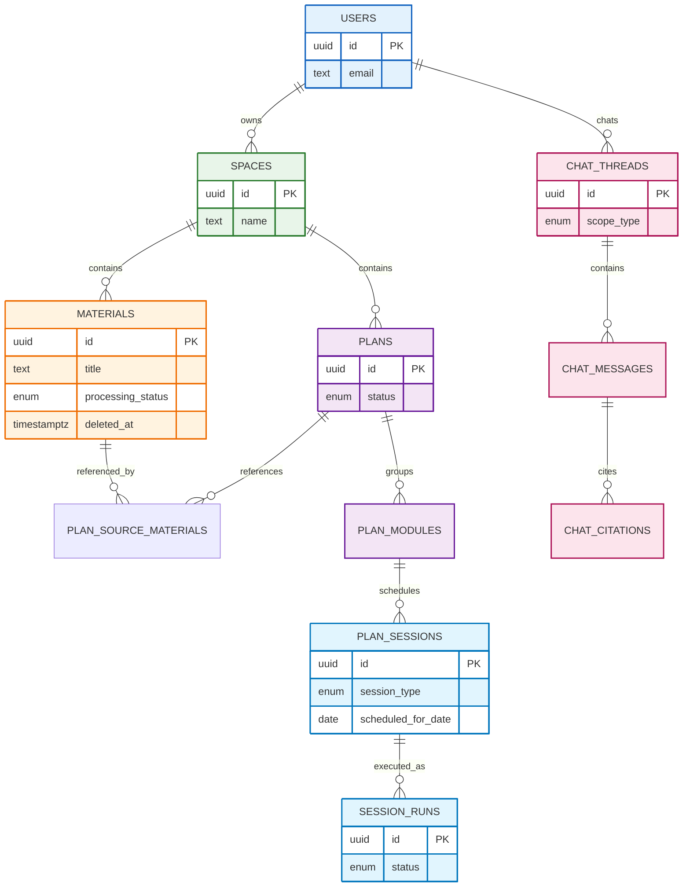

# 데이터 모델 (Data Models)

## 개요

이 문서는 AI 개인화 학습 플랫폼(Learning OS)의 **전체 기능을 빠짐없이 구현**할 수 있도록,
도메인 엔티티와 관계, 스키마 설계 원칙을 정의합니다.

- **Space**: 한 가지 학습 의도/목표 컨테이너
- **Document(=Material)**: 업로드/입력된 학습 자료
- **Plan**: 문서 스냅샷 기반의 학습 실행 단위
- **Module / Session**: 커리큘럼과 일일 실행 단위(학습/복습)
- **AI Chat**: Plan/Session 범위의 대화 및 근거(청크) 인용
- **Zombie Data(좀비 데이터)**: `deleted_at` 기반 소프트 삭제 + GC(가비지 컬렉션)

> 기술 스택 가정: PostgreSQL + Drizzle ORM + pgvector + R2(Object Storage)

## 설계 원칙

### 1) 스코프 규칙 (User → Space → 리소스)

- 모든 핵심 데이터는 `user_id`를 통해 소유권을 명확히 합니다.
- 대부분의 학습 리소스는 `space_id`에 종속됩니다(문서/플랜/세션/토픽).

### 2) “Documents”는 UI 용어, DB는 `materials`

- 제품 문서의 Documents(자료) = 엔지니어링/백엔드의 `materials` 테이블을 의미합니다.

### 3) 소프트 삭제 기본값

- `materials.deleted_at IS NULL`이면 정상 노출
- `deleted_at`이 설정되면 UI에서 숨기되, Plan이 참조 중이면 시스템에는 유지
- GC 트리거(Plan 완료/삭제 등) 시 “참조가 0”인 소프트 삭제 Material을 물리 제거

### 4) 실행(Session)과 기록(Session Run)을 분리

- **Plan Session(스케줄)**: “오늘 할 일(큐)”에 올라오는 실행 단위
- **Session Run(실행 기록)**: 사용자가 실제로 수행한 시도(시작/종료/중간이탈/복구)

### 5) 검색/추천은 2트랙

- **정형 검색**: 제목/요약/태그 (FTS)
- **시맨틱 검색**: 청크 임베딩(pgvector)

---

## 엔티티 관계도 (Core ERD)

---

## 엔티티/테이블 정의

아래 표기는 “권장” 스키마입니다. 실제 Drizzle 구현 시 네이밍은 `snake_case`를 권장합니다.

---

# 1. Identity & Access (로그인/세션)

## USERS

| 필드          | 타입          | 설명                |
| ------------- | ------------- | ------------------- |
| id            | uuid (PK)     | 사용자 ID           |
| email         | text (unique) | 로그인 이메일       |
| display_name  | text          | 표시 이름           |
| avatar_url    | text          | 프로필 이미지       |
| status        | enum          | `ACTIVE / DISABLED` |
| locale        | text          | 예: `ko-KR`         |
| timezone      | text          | 예: `Asia/Seoul`    |
| created_at    | timestamptz   | 생성 시각           |
| updated_at    | timestamptz   | 수정 시각           |
| last_login_at | timestamptz   | 마지막 로그인       |

## AUTH_ACCOUNTS (OAuth 연동)

| 필드                | 타입                 | 설명               |
| ------------------- | -------------------- | ------------------ |
| id                  | uuid (PK)            | 계정 ID            |
| user_id             | uuid (FK → users.id) | 소유 사용자        |
| provider            | enum                 | `GOOGLE` (MVP)     |
| provider_account_id | text                 | provider user id   |
| access_token_enc    | text                 | (선택) 암호화 저장 |
| refresh_token_enc   | text                 | (선택) 암호화 저장 |
| scopes              | text                 | scope 원문         |
| created_at          | timestamptz          | 생성               |

## MAGIC_LINK_TOKENS (이메일 매직링크)

| 필드          | 타입        | 설명                           |
| ------------- | ----------- | ------------------------------ |
| id            | uuid (PK)   | 토큰 ID                        |
| email         | text        | 수신 이메일                    |
| token_hash    | text        | 원문 저장 금지(해시)           |
| expires_at    | timestamptz | 만료                           |
| consumed_at   | timestamptz | 사용 완료 시각                 |
| redirect_path | text        | 로그인 후 이동 경로(검증 필요) |
| created_ip    | text        | 보안 추적                      |
| user_agent    | text        | 보안 추적                      |
| created_at    | timestamptz | 생성                           |

## AUTH_SESSIONS (로그인 세션)

| 필드               | 타입        | 설명                   |
| ------------------ | ----------- | ---------------------- |
| id                 | uuid (PK)   | 세션 ID                |
| user_id            | uuid (FK)   | 사용자                 |
| session_token_hash | text        | 세션 토큰 해시         |
| expires_at         | timestamptz | 만료                   |
| revoked_at         | timestamptz | 폐기                   |
| created_ip         | text        | 보안                   |
| user_agent         | text        | 보안                   |
| rotated_from_id    | uuid        | 세션 재발급 체인(선택) |
| created_at         | timestamptz | 생성                   |

---

# 2. Space (학습 공간)

## SPACES

| 필드        | 타입        | 설명                      |
| ----------- | ----------- | ------------------------- |
| id          | uuid (PK)   | Space ID                  |
| user_id     | uuid (FK)   | 소유자                    |
| name        | text        | Space명                   |
| description | text        | 선택                      |
| icon        | text        | 선택(이모지/아이콘 키)    |
| color       | text        | 선택                      |
| sort_order  | int         | 목록 정렬(선택)           |
| archived_at | timestamptz | 보관(숨김)                |
| deleted_at  | timestamptz | 삭제(선택: 보관보다 강함) |
| created_at  | timestamptz | 생성                      |
| updated_at  | timestamptz | 수정                      |

> 기본 템플릿(Work/Hobby/Growth)은 “시드 데이터”로 제공하는 것을 권장합니다.

---

# 3. Tags (문서/개념 태그)

## TAGS

| 필드       | 타입        | 설명                     |
| ---------- | ----------- | ------------------------ |
| id         | uuid (PK)   | 태그 ID                  |
| user_id    | uuid (FK)   | 사용자 스코프(개인 태그) |
| name       | text        | 표기명                   |
| slug       | text        | 정규화(검색/중복 방지)   |
| created_at | timestamptz | 생성                     |

## MATERIAL_TAGS

| 필드        | 타입        | 설명                 |
| ----------- | ----------- | -------------------- |
| material_id | uuid (FK)   | 문서                 |
| tag_id      | uuid (FK)   | 태그                 |
| source      | enum        | `AI / USER`          |
| confidence  | numeric     | AI 태그 신뢰도(선택) |
| created_at  | timestamptz | 생성                 |

---

# 4. Materials (Documents) + 처리 파이프라인

## MATERIALS (Documents)

| 필드              | 타입        | 설명                                    |
| ----------------- | ----------- | --------------------------------------- |
| id                | uuid (PK)   | Material ID                             |
| user_id           | uuid (FK)   | 소유자                                  |
| space_id          | uuid (FK)   | Space                                   |
| source_type       | enum        | `FILE / URL / TEXT`                     |
| title             | text        | 문서 제목                               |
| original_filename | text        | 파일 업로드 시                          |
| source_url        | text        | URL 입력 시                             |
| raw_text          | text        | TEXT 입력 시(또는 추출 텍스트 요약본)   |
| storage_provider  | enum        | `R2`                                    |
| storage_key       | text        | R2 object key                           |
| mime_type         | text        | 예: `application/pdf`                   |
| file_size         | bigint      | 바이트                                  |
| checksum          | text        | 중복/무결성(선택)                       |
| processing_status | enum        | `PENDING / PROCESSING / READY / FAILED` |
| processed_at      | timestamptz | 분석 완료 시각                          |
| summary           | text        | AI 1줄/짧은 요약                        |
| error_message     | text        | 실패 시                                 |
| deleted_at        | timestamptz | **소프트 삭제(좀비 데이터 핵심)**       |
| created_at        | timestamptz | 생성                                    |
| updated_at        | timestamptz | 수정                                    |

### 권장 인덱스

- `(space_id, created_at desc)`
- `(space_id) WHERE deleted_at IS NULL` (부분 인덱스)
- `(processing_status, space_id)` (READY 문서만 Plan에 선택 가능)

## MATERIAL_JOBS (비동기 처리 작업)

| 필드        | 타입        | 설명                                           |
| ----------- | ----------- | ---------------------------------------------- |
| id          | uuid (PK)   | 작업 ID                                        |
| material_id | uuid (FK)   | 대상 문서                                      |
| job_type    | enum        | `TEXT_EXTRACT / OUTLINE / CHUNK / EMBED / TAG` |
| status      | enum        | `QUEUED / RUNNING / SUCCEEDED / FAILED`        |
| progress    | numeric     | 0~1 (선택)                                     |
| started_at  | timestamptz | 시작                                           |
| finished_at | timestamptz | 종료                                           |
| error_json  | jsonb       | 실패 상세                                      |
| created_at  | timestamptz | 생성                                           |

## MATERIAL_CHUNKS (RAG 청킹)

| 필드         | 타입        | 설명                    |
| ------------ | ----------- | ----------------------- |
| id           | uuid (PK)   | 청크 ID                 |
| material_id  | uuid (FK)   | 문서                    |
| ordinal      | int         | 문서 내 순서            |
| content      | text        | 청크 텍스트             |
| token_count  | int         | 선택                    |
| page_start   | int         | PDF page(선택)          |
| page_end     | int         | PDF page(선택)          |
| section_path | text        | outline 기반 경로(선택) |
| created_at   | timestamptz | 생성                    |

## MATERIAL_EMBEDDINGS (pgvector)

| 필드       | 타입        | 설명          |
| ---------- | ----------- | ------------- |
| id         | uuid (PK)   | 임베딩 ID     |
| chunk_id   | uuid (FK)   | 청크          |
| model      | text        | 임베딩 모델명 |
| vector     | vector      | pgvector 컬럼 |
| created_at | timestamptz | 생성          |

### 권장 인덱스

- `ivfflat/hnsw` 등 pgvector 인덱스 (운영 전략에 맞춤)

## OUTLINE_NODES (Curriculum Structure / Topic Tree)

문서 구조 분석 결과(목차/토픽 트리)를 저장합니다. 사용자가 수동으로 목차/토픽을 만들지 않도록 하기 위한 핵심 데이터입니다.

| 필드        | 타입           | 설명              |
| ----------- | -------------- | ----------------- |
| id          | uuid (PK)      | 노드 ID           |
| material_id | uuid (FK)      | 문서              |
| space_id    | uuid (FK)      | 공간              |
| parent_id   | uuid (self FK) | 상위 노드         |
| node_type   | enum           | `SECTION / TOPIC` |
| title       | text           | 제목              |
| summary     | text           | 짧은 설명(선택)   |
| order_index | int            | 형제 내 순서      |
| depth       | int            | 트리 깊이         |
| path        | text           | 예: `1.2.3`       |
| created_at  | timestamptz    | 생성              |

---

# 5. Plans (생성/운영) + 스냅샷 참조

## PLAN_GENERATION_REQUESTS (위저드 입력/생성 상태)

Plan 생성 위저드의 입력을 저장하고, AI 생성 작업의 상태/오류/결과를 추적합니다.

| 필드                 | 타입        | 설명                                                             |
| -------------------- | ----------- | ---------------------------------------------------------------- |
| id                   | uuid (PK)   | 요청 ID                                                          |
| user_id              | uuid (FK)   | 사용자                                                           |
| space_id             | uuid (FK)   | Space                                                            |
| status               | enum        | `DRAFT / SUBMITTED / GENERATING / SUCCEEDED / FAILED / CANCELED` |
| goal_type            | enum        | `JOB / CERT / WORK / HOBBY / OTHER`                              |
| goal_text            | text        | 자유 입력(선택)                                                  |
| current_level        | enum        | `BEGINNER / INTERMEDIATE / ADVANCED`                             |
| target_due_date      | date        | 목표 기한                                                        |
| special_requirements | text        | 요구사항                                                         |
| preview_json         | jsonb       | AI 프리뷰(선택)                                                  |
| error_message        | text        | 실패                                                             |
| created_at           | timestamptz | 생성                                                             |
| updated_at           | timestamptz | 수정                                                             |

## PLAN_GENERATION_REQUEST_MATERIALS

| 필드        | 타입        | 설명      |
| ----------- | ----------- | --------- |
| request_id  | uuid (FK)   | 생성 요청 |
| material_id | uuid (FK)   | 선택 문서 |
| order_index | int         | 선택 순서 |
| created_at  | timestamptz | 생성      |

> 제약: 최소 1개, 최대 5개 / `materials.processing_status=READY`만 허용

## PLANS

| 필드                  | 타입        | 설명                                     |
| --------------------- | ----------- | ---------------------------------------- |
| id                    | uuid (PK)   | Plan ID                                  |
| user_id               | uuid (FK)   | 사용자                                   |
| space_id              | uuid (FK)   | Space                                    |
| generation_request_id | uuid (FK)   | 생성 요청(선택)                          |
| title                 | text        | Plan명                                   |
| status                | enum        | `ACTIVE / PAUSED / ARCHIVED / COMPLETED` |
| goal_type             | enum        | 위와 동일                                |
| goal_text             | text        | 선택                                     |
| current_level         | enum        | 위와 동일                                |
| target_due_date       | date        | 목표 기한                                |
| special_requirements  | text        | 요구사항                                 |
| started_at            | timestamptz | Active 전환 시점(선택)                   |
| completed_at          | timestamptz | 완료                                     |
| archived_at           | timestamptz | 보관                                     |
| deleted_at            | timestamptz | 삭제(선택)                               |
| created_at            | timestamptz | 생성                                     |
| updated_at            | timestamptz | 수정                                     |

### 권장 제약/인덱스

- (권장) Space 내 **ACTIVE Plan 1개**를 강제하려면: `UNIQUE(space_id) WHERE status='ACTIVE'`

## PLAN_SOURCE_MATERIALS (문서 참조 고정 = 스냅샷 참조)

Plan이 생성될 때 선택한 문서를 고정 참조합니다. 좀비 데이터/GC의 “참조 카운트” 근거가 됩니다.

| 필드                    | 타입        | 설명                        |
| ----------------------- | ----------- | --------------------------- |
| plan_id                 | uuid (FK)   | Plan                        |
| material_id             | uuid (FK)   | 문서                        |
| material_title_snapshot | text        | 생성 당시 제목 스냅샷(선택) |
| order_index             | int         | Plan 내 문서 순서           |
| created_at              | timestamptz | 생성                        |

---

# 6. Curriculum: Modules & Sessions (학습/복습 스케줄)

## PLAN_MODULES

| 필드        | 타입        | 설명                  |
| ----------- | ----------- | --------------------- |
| id          | uuid (PK)   | Module ID             |
| plan_id     | uuid (FK)   | Plan                  |
| title       | text        | 예: `Module 2: Hooks` |
| description | text        | 범위/목표             |
| order_index | int         | 순서                  |
| created_at  | timestamptz | 생성                  |

## PLAN_SESSIONS (스케줄 엔티티: Home/Plan 상세 큐의 원천)

학습/복습 모두 “세션”으로 모델링합니다. (Home 큐의 `Session/Review`를 그대로 구현)

| 필드               | 타입        | 설명                                                       |
| ------------------ | ----------- | ---------------------------------------------------------- |
| id                 | uuid (PK)   | Session ID                                                 |
| plan_id            | uuid (FK)   | Plan                                                       |
| module_id          | uuid (FK)   | Module (복습은 null 가능)                                  |
| session_type       | enum        | `LEARN / REVIEW`                                           |
| title              | text        | 예: `Session 1: useState`                                  |
| objective          | text        | 세션 목표(선택)                                            |
| order_index        | int         | Module/Plan 내 순서                                        |
| scheduled_for_date | date        | “오늘 할 일” 기준일                                        |
| estimated_minutes  | int         | 20~40 권장                                                 |
| status             | enum        | `SCHEDULED / IN_PROGRESS / COMPLETED / SKIPPED / CANCELED` |
| created_at         | timestamptz | 생성                                                       |
| updated_at         | timestamptz | 수정                                                       |
| completed_at       | timestamptz | 완료                                                       |

---

# 7. Session Execution (풀스크린 세션 실행/복구/신호)

## SESSION_RUNS (실행 기록)

| 필드        | 타입        | 설명                                           |
| ----------- | ----------- | ---------------------------------------------- |
| id          | uuid (PK)   | 실행 ID                                        |
| session_id  | uuid (FK)   | 스케줄 세션                                    |
| user_id     | uuid (FK)   | 사용자                                         |
| space_id    | uuid (FK)   | Space                                          |
| plan_id     | uuid (FK)   | Plan                                           |
| status      | enum        | `RUNNING / COMPLETED / ABANDONED`              |
| started_at  | timestamptz | 시작                                           |
| ended_at    | timestamptz | 종료                                           |
| exit_reason | enum        | `USER_EXIT / NETWORK / ERROR / TIMEOUT` (선택) |
| created_at  | timestamptz | 생성                                           |

## SESSION_PROGRESS_SNAPSHOTS (Session Recovery, 선택)

로컬 스토리지 + 서버 동기화용. 중단 복구를 구현할 때 사용합니다.

| 필드           | 타입        | 설명                   |
| -------------- | ----------- | ---------------------- |
| id             | uuid (PK)   | 스냅샷 ID              |
| session_run_id | uuid (FK)   | 실행                   |
| step_index     | int         | 1~N 단계               |
| payload_json   | jsonb       | 입력 텍스트/선택 값 등 |
| created_at     | timestamptz | 생성                   |

## SESSION_CHECKINS (이해도 체크: 저마찰 신호)

| 필드           | 타입        | 설명                                           |
| -------------- | ----------- | ---------------------------------------------- |
| id             | uuid (PK)   | 체크인 ID                                      |
| session_run_id | uuid (FK)   | 실행                                           |
| kind           | enum        | `QUESTION / SELF_ASSESSMENT / BEHAVIOR_SIGNAL` |
| prompt         | text        | 질문/안내                                      |
| response_json  | jsonb       | 응답(선택/텍스트/점수 등)                      |
| recorded_at    | timestamptz | 기록 시각                                      |

## SESSION_ACTIVITIES (적용 활동/실습 기록)

| 필드           | 타입        | 설명                               |
| -------------- | ----------- | ---------------------------------- |
| id             | uuid (PK)   | 활동 ID                            |
| session_run_id | uuid (FK)   | 실행                               |
| kind           | enum        | `EXERCISE / MCQ / FREEFORM / CODE` |
| prompt         | text        | 과제/문항                          |
| user_answer    | text        | 사용자 답                          |
| ai_eval_json   | jsonb       | AI 평가/피드백(선택)               |
| created_at     | timestamptz | 생성                               |

## SESSION_SUMMARIES (홈 카드/아카이브 진입점)

| 필드                    | 타입        | 설명           |
| ----------------------- | ----------- | -------------- |
| id                      | uuid (PK)   | 요약 ID        |
| session_run_id          | uuid (FK)   | 실행           |
| summary_md              | text        | 요약 마크다운  |
| reviews_scheduled_count | int         | 생성된 복습 수 |
| created_at              | timestamptz | 생성           |

---

# 9. AI Chat (Plan/Session 범위 대화 + 근거 인용)

## CHAT_THREADS

| 필드       | 타입        | 설명                     |
| ---------- | ----------- | ------------------------ |
| id         | uuid (PK)   | 스레드 ID                |
| user_id    | uuid (FK)   | 사용자                   |
| space_id   | uuid (FK)   | Space                    |
| scope_type | enum        | `SPACE / PLAN / SESSION` |
| scope_id   | uuid        | 해당 리소스 ID           |
| created_at | timestamptz | 생성                     |
| updated_at | timestamptz | 수정                     |

## CHAT_MESSAGES

| 필드          | 타입        | 설명                        |
| ------------- | ----------- | --------------------------- |
| id            | uuid (PK)   | 메시지 ID                   |
| thread_id     | uuid (FK)   | 스레드                      |
| role          | enum        | `USER / ASSISTANT / SYSTEM` |
| content_md    | text        | 메시지(마크다운 허용)       |
| token_count   | int         | 선택                        |
| metadata_json | jsonb       | 단계/세션 스텝 등           |
| created_at    | timestamptz | 생성                        |

## CHAT_CITATIONS (RAG 근거)

| 필드       | 타입                           | 설명               |
| ---------- | ------------------------------ | ------------------ |
| id         | uuid (PK)                      | 인용 ID            |
| message_id | uuid (FK)                      | 대상 메시지        |
| chunk_id   | uuid (FK → material_chunks.id) | 근거 청크          |
| score      | numeric                        | 관련도 점수        |
| quote      | text                           | 1~2문장 발췌(선택) |
| created_at | timestamptz                    | 생성               |

---

# 10. Home 경험을 위한 보조 엔티티

## COACH_MESSAGES (AI 코칭 메시지, 선택)

홈의 “AI 코칭 메시지”를 캐시/히스토리로 남기고 싶을 때 사용합니다.

| 필드         | 타입        | 설명        |
| ------------ | ----------- | ----------- |
| id           | uuid (PK)   | 메시지 ID   |
| user_id      | uuid (FK)   | 사용자      |
| date         | date        | 해당 일자   |
| content_md   | text        | 코칭 메시지 |
| context_json | jsonb       | 근거(선택)  |
| created_at   | timestamptz | 생성        |

> Home의 “할 일 큐”는 `plan_sessions.scheduled_for_date=today` + 상태 필터로 **파생** 가능합니다.
> 별도 QueueItem 테이블은 “정렬 고정/스누즈/핀” 같은 요구가 생길 때 도입을 권장합니다.

---

# 11. 이벤트/GC (Zombie Data)

## DOMAIN_EVENTS (선택)

디버깅/운영 가시성을 위해 도메인 이벤트를 저장합니다.

| 필드         | 타입        | 설명                                           |
| ------------ | ----------- | ---------------------------------------------- |
| id           | uuid (PK)   | 이벤트 ID                                      |
| user_id      | uuid        | 사용자                                         |
| space_id     | uuid        | Space(선택)                                    |
| event_type   | text        | 예: `MATERIAL_SOFT_DELETED`, `GC_RUN_FINISHED` |
| payload_json | jsonb       | 상세                                           |
| created_at   | timestamptz | 생성                                           |

### GC 기본 규칙(요약)

- Material 삭제(소프트): `materials.deleted_at=now()`
- GC 트리거: Plan 삭제/완료/정리 시점
- GC 동작:
  1. Plan이 참조하던 `plan_source_materials.material_id` 조회
  2. 각 material에 대해:
     - `deleted_at IS NOT NULL` 이고
     - 다른 Plan 참조가 0이면(= `plan_source_materials`에서 더 이상 참조되지 않으면)
       - R2 오브젝트 삭제
       - `material_chunks`, `material_embeddings`, `outline_nodes` 등 종속 데이터 삭제
       - `materials` 레코드 삭제(또는 purge 마킹 후 삭제)

---

## 구현 체크리스트 (이 문서가 커버하는 기능)

- 로그인: Google OAuth / 이메일 매직링크 / 세션 재발급
- Space: 생성/수정/보관/삭제(정책 확장 가능)
- Documents(Materials): 파일/URL/텍스트 입력, 상태(PENDING/PROCESSING/READY/FAILED), 요약/태그
- 자동 분석: outline/topic tree, chunking, embedding(pgvector)
- Plan 생성 위저드: 문서 선택(1~5, READY만), 목표/수준/기한/요구사항, 생성 상태 추적
- Plan 운영: Active/Pause/Resume/Archive/Complete
- Session: 학습/복습 스케줄(오늘 큐), 실행 기록(Session Run), 이해도 신호/활동/요약 카드
- Session Recovery(선택): 서버 스냅샷
- AI Chat: Plan 범위 대화, 문서 청크 인용 저장
- Zombie Data: deleted_at 기반 문서 삭제 + GC

---

## 관련 문서

- [기술 스택](./tech-stack.md)
- [시스템 아키텍처](./architecture.md)
- [학습 자료 삭제 정책(좀비 데이터)](./policies/material-deletion.md)
