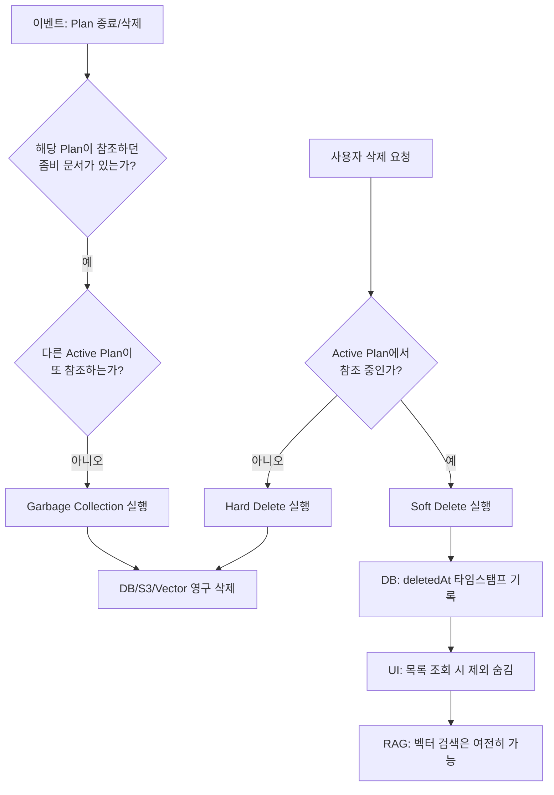

# 학습 자료 삭제 정책: 좀비 데이터(Zombie Data) 전략

## 1. 배경 및 문제 정의

### 1.1. 현황

사용자가 업로드한 문서(Material)는 학습 계획(Plan) 생성 시 RAG(검색 증강 생성)의 원천 데이터로 사용됩니다. 'Plan'은 생성 시점에 선택된 문서들을 기반으로 동작합니다.

### 1.2. 문제점 (Conflict)

사용자가 학습 도중 **[자료 삭제]**를 시도할 때, 두 가지 상충하는 가치가 충돌합니다.

1. **데이터 무결성 (System Integrity):**
   - 진행 중인 Plan이 참조하는 문서를 물리적으로 삭제하면, 벡터 저장소(Vector Store) 검색이 불가능해져 AI 답변 생성 및 세션 진행에 치명적인 오류가 발생합니다.

2. **사용자 편의성 (User Experience):**
   - 사용자는 단순히 목록을 정리하고 싶어 하며, 내부적인 데이터 종속성(Dependency)까지 신경 쓰고 싶어 하지 않습니다.

---

## 2. 검토된 대안 및 의사결정 과정

본 문제를 해결하기 위해 3가지 방안을 검토하였으며, 최종적으로 **제3안(암시적 소프트 삭제)**을 채택하였습니다.

| **구분** | **1안: 삭제 차단 (Restrict)**                                       | **2안: 명시적 보관함 (Archive UI)**                   | **3안: 암시적 숨김 (Implicit Soft Delete)**              |
| -------- | ------------------------------------------------------------------- | ----------------------------------------------------- | -------------------------------------------------------- |
| **방식** | "사용 중인 자료입니다. 플랜을 먼저 삭제하세요" 경고 후 차단         | 삭제 대신 [보관] 버튼 제공, 별도의 '보관함' 탭 운영   | **[삭제] 시 목록에서 즉시 제거, 백엔드에서만 임시 유지** |
| **장점** | 구현이 매우 쉬움, 데이터 무결성 완벽 보장                           | 데이터 관리의 투명성 확보                             | **가장 심플한 UX, 사용자 관리 부담 0**                   |
| **단점** | **최악의 UX.** 파일 하나 지우려고 학습 기록(Progress)을 포기해야 함 | **복잡한 UX.** MVP에 불필요한 '보관함 관리' 기능 추가 | 백엔드 로직(Garbage Collection) 구현 필요                |
| **결론** | **기각 (Reject)**                                                   | **기각 (Reject)**                                     | **채택 (Accept)**                                        |

> **채택 사유:** 본 프로젝트의 핵심 UX 원칙인 **"단순성(Simplicity)"**에 따라, 사용자가 인지해야 할 기능(보관함)을 늘리지 않고 시스템이 알아서 처리하는 방식이 가장 적합함.

---

## 3. 상세 솔루션: 좀비 데이터(Zombie Data) 전략

사용자 눈에는 **"삭제"**된 것처럼 보이지만, 시스템 내부적으로는 **"학습이 끝날 때까지 좀비처럼 살아있는"** 상태를 관리합니다.

### 3.1. UX/UI 정의

사용자에게는 '보관'이나 '숨김' 개념을 노출하지 않습니다.

1. **동작:** 사용자가 **[삭제]** 아이콘 클릭.
2. **피드백:**
   - **참조 중인 Plan이 없을 때:** 즉시 목록에서 사라짐.  
     메시지: _"삭제되었습니다."_
   - **참조 중인 Plan이 있을 때:** 즉시 목록에서 사라짐.  
     메시지: _"목록에서 삭제되었습니다. (진행 중인 학습을 위해 데이터는 유지됩니다.) cache..."_
3. **결과:** 사용자의 `Documents` 목록은 즉시 깨끗해집니다.

### 3.2. 프로세스 로직



---

## 4. 기술 명세 (Implementation Specs)

### 4.1. 데이터베이스 스키마 변경 (`Material`)

별도의 상태(Enum) 필드 대신 `deletedAt` 필드 하나로 로직을 제어합니다.

```typescript
// packages/database/schema.ts

export const materials = pgTable("materials", {
  // ... 기존 필드 (id, title, userId 등)

  // [추가] 삭제 요청 시각
  // - null: 정상 표시 상태
  // - not null: 삭제 요청됨 (UI 숨김, 시스템 유지 중)
  deletedAt: timestamp("deleted_at"),
});
```

### 4.2. API 로직 변경

#### A. 목록 조회 API (`GET /materials`)

기본적으로 사용자의 자료 중 삭제되지 않은(`deletedAt IS NULL`) 항목만 반환합니다.

```typescript
// 서비스 계층 예시
const getMaterials = async (userId: string) => {
  return db
    .select()
    .from(materials)
    .where(
      and(
        eq(materials.userId, userId),
        isNull(materials.deletedAt), // 삭제된 것 제외
      ),
    );
};
```

#### B. 삭제 API (`DELETE /materials/:id`)

단순 삭제가 아닌 조건부 로직을 수행합니다.

```typescript
// 서비스 계층 예시
const deleteMaterial = async (materialId: string) => {
  // 1. 해당 문서를 참조하는 Active 상태의 Plan이 있는지 확인
  const activePlans = await db
    .select()
    .from(plans)
    .where(arrayContains(plans.sourceMaterialIds, [materialId]))
    .where(eq(plans.status, "active"));

  if (activePlans.length > 0) {
    // [Soft Delete] 좀비 상태로 전환
    await db
      .update(materials)
      .set({ deletedAt: new Date() })
      .where(eq(materials.id, materialId));

    return {
      type: "soft",
      message:
        "목록에서 삭제되었습니다. (진행 중인 학습을 위해 데이터는 유지됩니다.)",
    };
  } else {
    // [Hard Delete] 물리적 삭제 수행
    await deleteFileFromR2(materialId); // 파일 스토리지 삭제
    await deleteVectors(materialId); // 벡터 DB 삭제
    await db.delete(materials).where(eq(materials.id, materialId));

    return {
      type: "hard",
      message: "삭제되었습니다.",
    };
  }
};
```

#### C. Garbage Collection (Plan 삭제/완료 시)

Plan이 종료되거나 삭제될 때, 참조하던 좀비 문서를 정리합니다.

```typescript
const cleanupZombieMaterials = async (planId: string) => {
  // 1. 해당 Plan이 참조하던 문서 ID 목록 조회
  const plan = await db
    .select()
    .from(plans)
    .where(eq(plans.id, planId))
    .limit(1);

  if (!plan[0]) return;

  const materialIds = plan[0].sourceMaterialIds;

  // 2. 각 문서별로 좀비 상태인지 확인
  for (const matId of materialIds) {
    const material = await db
      .select()
      .from(materials)
      .where(eq(materials.id, matId))
      .limit(1);

    // deletedAt이 null이면 정상 상태이므로 스킵
    if (!material[0] || !material[0].deletedAt) continue;

    // 3. 다른 Active Plan이 이 문서를 참조하는지 확인
    const otherActivePlans = await db
      .select()
      .from(plans)
      .where(arrayContains(plans.sourceMaterialIds, [matId]))
      .where(eq(plans.status, "active"))
      .where(ne(plans.id, planId));

    // 4. 다른 Plan이 없으면 Hard Delete 실행
    if (otherActivePlans.length === 0) {
      await deleteFileFromR2(matId);
      await deleteVectors(matId);
      await db.delete(materials).where(eq(materials.id, matId));
    }
  }
};
```

---

## 5. 테스트 시나리오

### 시나리오 1: 사용 중인 자료 삭제

1. Document A를 업로드
2. Document A를 포함한 Plan 1 생성 (Active 상태)
3. Document A 삭제 시도
   - ✅ **예상 결과:** 목록에서 사라지고, "진행 중인 학습을 위해 데이터는 유지됩니다" 메시지 표시
   - ✅ **내부 상태:** `deletedAt`이 현재 시각으로 설정됨
4. Plan 1의 AI 채팅에서 질문
   - ✅ **예상 결과:** Document A의 벡터 검색이 정상 작동, AI 응답 생성 성공

### 시나리오 2: Plan 완료 후 Garbage Collection

1. (시나리오 1 이어서) Plan 1을 `archived` 상태로 변경
   - ✅ **예상 결과:** Document A가 완전히 삭제됨 (DB, R2, Vector Store)

---

## 관련 문서

- [데이터 모델](../data-models.md)
- [Materials API](../api/materials.md)
- [Plan 상세 페이지](../../03-product/pages/plan-detail.md)
