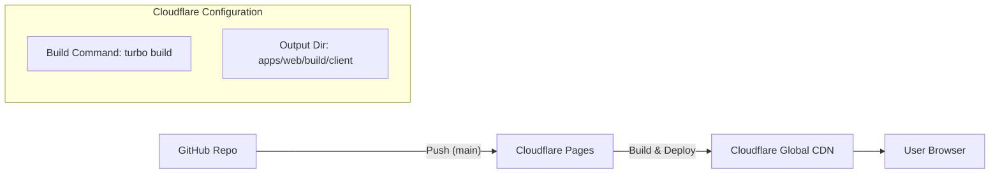

# 🚀 Web 앱 배포 가이드 (Cloudflare Pages)

이 문서는 `apps/web` (React Router SPA) 애플리케이션을 Cloudflare Pages를 통해 배포하는 방법을 설명합니다.

## 📋 아키텍처 개요

Cloudflare Pages와 GitHub 저장소를 연결하여, `main` 브랜치에 코드가 푸시될 때마다 자동으로 빌드하고 배포합니다.



### 배포 URL

- **Production**: https://lolog.site

---

## 🔧 Cloudflare Pages 설정

Cloudflare Dashboard에서 다음과 같이 프로젝트를 설정합니다.

### 1. 프로젝트 생성

1. **Cloudflare Dashboard** > **Workers & Pages** > **Pages** 접속
2. **Connect to Git** 선택
3. GitHub 저장소(`lolog/turbo-local-market`) 연결 및 선택

### 2. 빌드 구성 (Build Configuration)

모노레포 구조(Turborepo)에 맞게 다음과 같이 설정합니다.

| 설정 항목                  | 값                                 | 설명                        |
| -------------------------- | ---------------------------------- | --------------------------- |
| **Project Name**           | `lolog-web`                        | 프로젝트 식별 이름          |
| **Framework Preset**       | `None`                             | 사용자 정의 설정 사용       |
| **Build command**          | `npx turbo run build --filter=web` | 웹 앱만 필터링하여 빌드     |
| **Build output directory** | `apps/web/build/client`            | SPA 모드 빌드 결과물 경로   |
| **Root directory**         | `/` (비워둠)                       | 프로젝트 루트에서 빌드 실행 |

### 3. 환경 변수 (Environment Variables)

**Settings** > **Environment variables** > **Production**에 설정합니다.

| 변수명              | 값                       | 설명                     |
| ------------------- | ------------------------ | ------------------------ |
| `NODE_VERSION`      | `20`                     | Node.js 버전 지정 (필수) |
| `VITE_API_BASE_URL` | `https://api.lolog.site` | 백엔드 API 주소          |

> **참고**: `VITE_` 접두사가 붙은 환경 변수는 빌드 시점에 클라이언트 코드에 주입됩니다.

---

## 🚀 배포 방법

### 자동 배포 (Continuous Deployment)

GitHub 저장소의 `main` 브랜치에 변경 사항을 푸시하면 Cloudflare Pages가 자동으로 감지하여 배포를 시작합니다.

1. 코드 변경 후 커밋:
   ```bash
   git add .
   git commit -m "feat: update landing page"
   ```
2. 원격 저장소 푸시:
   ```bash
   git push origin main
   ```
3. Cloudflare Dashboard에서 빌드 상태 확인.

---

## 🌐 도메인 설정 (Custom Domain)

기본 도메인(`*.pages.dev`) 외에 사용자 지정 도메인을 연결합니다.

1. **Cloudflare Pages** > **Custom domains** 탭 클릭
2. **Set up a custom domain** 클릭
3. 도메인 입력: `lolog.site`
4. DNS 레코드 자동 설정 진행 (Cloudflare DNS를 사용하는 경우 CNAME 레코드가 자동으로 추가됨)

> **참고**: `api.lolog.site`는 Oracle Cloud를 가리키고, `lolog.site`는 Cloudflare Pages를 가리키도록 DNS가 설정되어야 합니다.

---

## 🛠️ 트러블슈팅

### 빌드 실패: "Command not found: turbo"

- **원인**: `turbo` 패키지가 전역으로 설치되어 있지 않거나 경로 문제.
- **해결**: Build command를 `npx turbo run build --filter=web`으로 수정하여 `npx`를 사용하거나 `package.json`의 스크립트를 사용하세요.

### 환경 변수 누락

- **증상**: API 호출이 실패하거나 URL이 비어 있음.
- **해결**: Cloudflare Pages 대시보드에서 `VITE_API_BASE_URL`이 올바르게 설정되었는지 확인하고, 변경 후에는 **새로 배포(Re-deploy)**해야 적용됩니다.

### SPA 라우팅 문제 (404 Error)

- **증상**: 새로고침 시 404 에러 발생.
- **해결**: Cloudflare Pages는 기본적으로 SPA 라우팅을 지원하기 위해 `_redirects` 파일을 사용하거나, 모든 요청을 `index.html`로 보내야 합니다. React Router의 SPA 설정(`ssr: false`)과 빌드 출력물(`build/client`)이 올바른지 확인하세요. Cloudflare Pages는 존재하지 않는 파일 요청을 자동으로 `index.html`로 리다이렉트 처리하는 기본 동작(Single Page App redirect)을 수행합니다.

---

## 📚 참고 자료

- [Cloudflare Pages Documentation](https://developers.cloudflare.com/pages/)
- [React Router v7 Deploying](https://reactrouter.com/start/framework/deploying)
- [Cloudflare Pages Monorepos](https://developers.cloudflare.com/pages/configuration/monorepos/)
